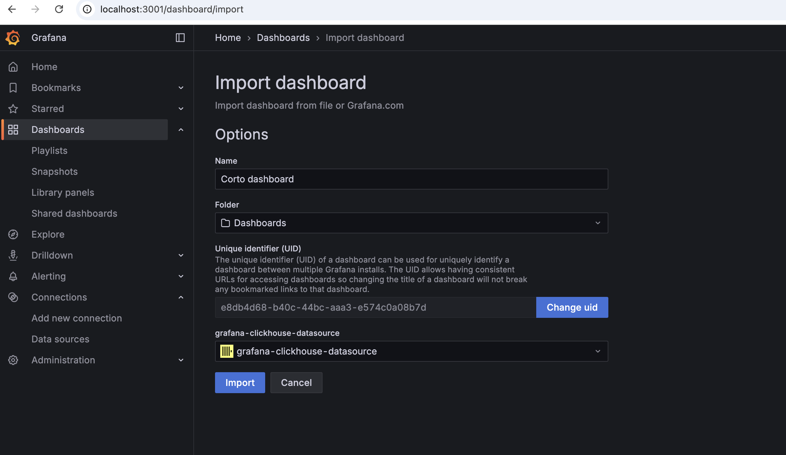
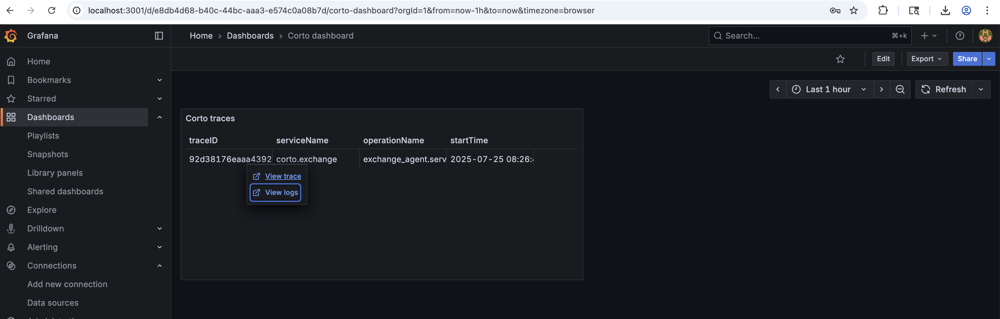
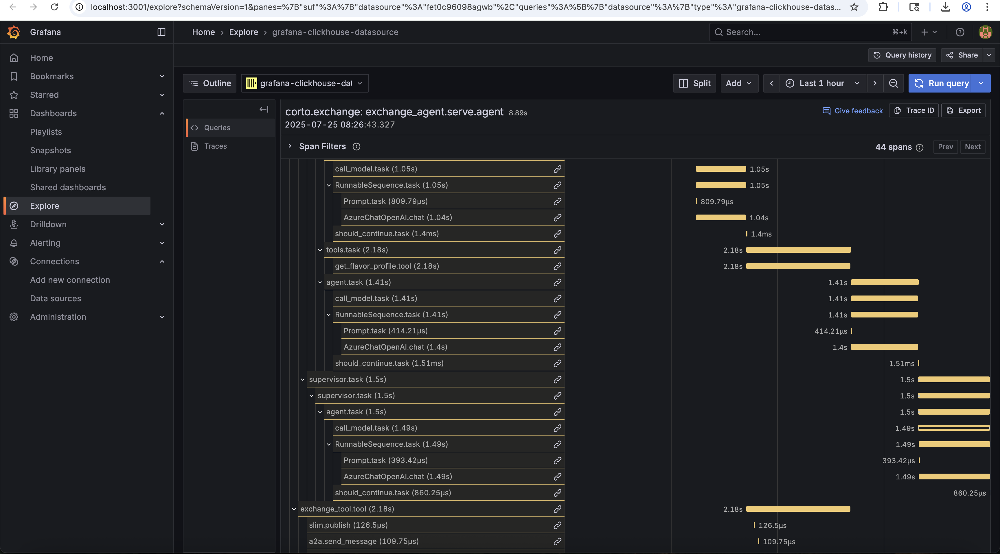
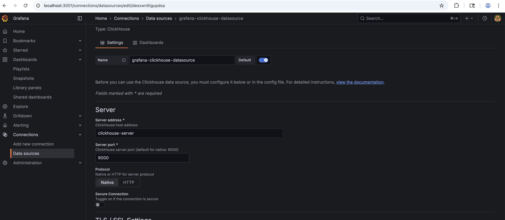
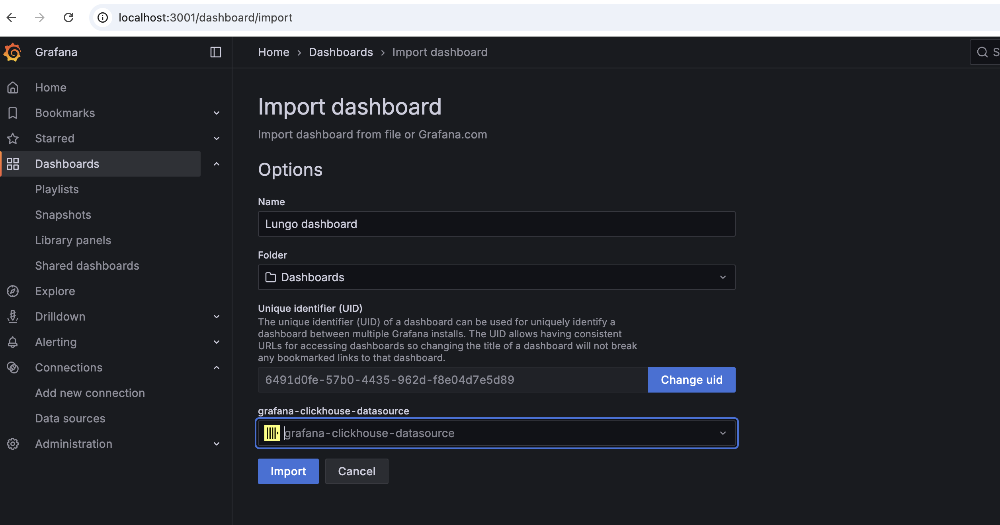
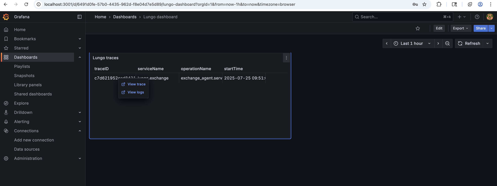
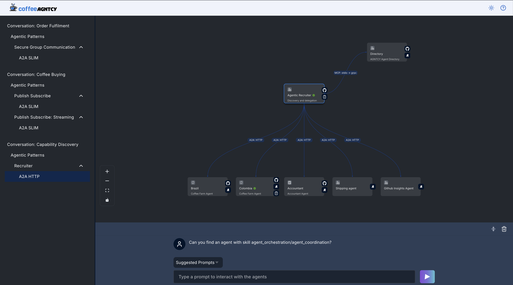

# Exploring CoffeeAGNTCY ☕️

Welcome! This hands-on tutorial combines **multiple reference apps** based on a fictitious coffee company navigating supply chain use cases to showcase how components in the **AGNTCY Internet of Agents** are meant to work together.

You will:

1. Interact with **four demos** (Lungo Auction, Lungo Logistic, Lungo Recruiter, Corto Sommelier)
2. Spin up each demo with docker compose
3. Use **preconfigured prompts** (and your own)
4. Explore **traces and metrics** 

## Prerequisites

- **Docker** + **Docker Compose**
- **Node.js ≥ 16.14.0** (if you run any UI locally outside of Docker)
- **uv** (Python environment manager)

Clone the CoffeeAGNTCY repository:
```bash
git clone https://github.com/agntcy/coffeeAgntcy.git
cd coffeeAgntcy
```

## Repo Layout

```
coffeeAGNTCY/
  coffee_agents/
    corto/
      exchange/           # Exchange API + UI
      farm/               # Farm A2A server
      docker-compose.yml. # Corto Docker Compose

    lungo/
      agents/
        supervisors/
          auction/        # Auction supervisor
          logistic/       # Logistic supervisor
          recruiter/      # Recruiter supervisor (dynamic workflow)
        farms/            # Brazil/Colombia/Vietnam farms
        logistics/        # Logistics farm, accountant, helpdesk, and shipper
        mcp_servers/      # Weather MCP server
      docker-compose.yml. # Lungo Docker Compose

    recruiter/            # Recruiter Service (A2A server for agent discovery & evaluation)
```

## Corto Sommelier

### 1. Setup

Copy and configure your environment:
```bash
cp .env.example .env
```

Update your .env file with the provider model, credentials, and OTEL endpoint.

CoffeeAGNTCY uses litellm to manage LLM connections. With litellm, you can seamlessly switch between different model providers using a unified configuration interface. Below are examples of environment variables for setting up various providers. For a comprehensive list of supported providers, see the [official litellm documentation](https://docs.litellm.ai/docs/providers).

In CoffeeAGNTCY, the environment variable for specifying the model is always LLM_MODEL, regardless of the provider.

   > ⚠️ **Note:** The `/agent/prompt/stream` endpoint requires an LLM that supports streaming. If your LLM provider does not support streaming, the streaming endpoint may fail.

   Then update `.env` with your LLM provider, credentials and OTEL endpoint. For example:

---

#### **OpenAI**

```env
LLM_MODEL="openai/<model_of_choice>"
OPENAI_API_KEY=<your_openai_api_key>
```

---

#### **Azure OpenAI**

```env
LLM_MODEL="azure/<your_deployment_name>"
AZURE_API_BASE=https://your-azure-resource.openai.azure.com/
AZURE_API_KEY=<your_azure_api_key>
AZURE_API_VERSION=<your_azure_api_version>
```

---

#### **GROQ**

```env
LLM_MODEL="groq/<model_of_choice>"
GROQ_API_KEY=<your_groq_api_key>
```

---

#### **NVIDIA NIM**

```env
LLM_MODEL="nvidia_nim/<model_of_choice>"
NVIDIA_NIM_API_KEY=<your_nvidia_api_key>
NVIDIA_NIM_API_BASE=<your_nvidia_nim_endpoint_url>
```

---
### 2. Launch the Demo Stack
All workshop services are containerized — start everything with one command:

```bash
docker compose up --build
```

This will start:
- The **Exchange** and **Farm** agents  
- The **UI** frontend
- The **SLIM and NATS message buses** for agent-to-agent communication  
- The **observability stack** (Grafana, OTEL Collector, ClickHouse)

Once containers are running, open:

- **Sommelier Demo:** [http://localhost:3000/](http://localhost:3000/)   
- **Grafana Dashboard:** [http://localhost:3001/](http://localhost:3001/)

### 3. Interact with the Demos

Send prompts to the agentic system.  
Predefined prompts are provided to help you start — but you can also type your own.

#### Sommelier Demo (Agent to Agent Pattern)

This demo showcases an **Supervisor Agent** that communicates with a **Grader Agent**, which acts as a virtual Coffee Sommelier. When queried, the Grader Agent provides detailed flavor profiles for specific coffees.

**Supervisor Agent:** A2A client  
**Grader Agent:** LangGraph-orchestrated A2A server  

The two agents communicate via the **SLIM message bus**. You can explore SLIM integrations in the following source files within the app-sdk repository:

- [`exchange/agent.py`](./coffeeAGNTCY/coffee_agents/corto/exchange/agent.py)  
- [`farm/farm_server.py`](./coffeeAGNTCY/coffee_agents/corto/farm/farm_server.py)

**Example prompts:**
- `What are the flavor profiles of Ethiopian coffee?`
- `What does coffee harvested in Colombia in the summer taste like?`

As you run the demo, observe in your Docker Compose logs how:
- The **Supervisor** delegates to the **Grader Agent** over SLIM using the A2A protocol.

### 4. Inspect Traces in Grafana

Once you’ve executed a few prompts:

1. Go to [http://localhost:3001/](http://localhost:3001/)
2. Log in with:
   ```
   Username: admin
   Password: admin
   ```
3. Connect/Add the ClickHouse Datasource
   - In the left sidebar, click on **"Connections" > "Data sources"**.
   - If not already present, add a new **ClickHouse** datasource with the following settings:
     - **Server address:** `clickhouse-server`
     - **Port:** `9000`
     - **Protocol:** `native`
     - **User/Password:** `admin` / `admin`
   - If already present, select the **ClickHouse** datasource (pre-configured in the Docker Compose setup).

   
   
    
4. Import the OTEL Traces Dashboard 
   - In the left sidebar, click on **"Dashboards" > "New" > "Import"**.
   - Upload or paste the JSON definition for the OTEL traces dashboard, located here:  
     [`corto_dashboard.json`](coffeeAGNTCY/coffee_agents/corto/corto_dashboard.json)
   - **When prompted, select `grafana-clickhouse-datasource` as the datasource.**
   - Click **"Import"** to add the dashboard.

   
5. View Traces
   - Navigate to the imported dashboard.
   - You should see traces and spans generated by the Corto agents as they process requests.
   - **To view details of a specific trace, click on a TraceID in the dashboard. This will open the full trace and its spans for further inspection.**

   
   

### 5. Cleanup

When done, stop all containers:

```bash
docker compose down
```

## Lungo Auction & Logistics

### 1. Setup

If you tried out Corto Sommelier, copy the .env file from Corto to Lungo.
```bash
cp ../corto/.env .env
```

Or set up your .env from scratch:
```bash
cp .env.example .env
```

Update your .env file with the provider model, credentials, and OTEL endpoint.

CoffeeAGNTCY uses litellm to manage LLM connections. With litellm, you can seamlessly switch between different model providers using a unified configuration interface. Below are examples of environment variables for setting up various providers. For a comprehensive list of supported providers, see the [official litellm documentation](https://docs.litellm.ai/docs/providers).

In CoffeeAGNTCY, the environment variable for specifying the model is always LLM_MODEL, regardless of the provider.

   > ⚠️ **Note:** The `/agent/prompt/stream` endpoint requires an LLM that supports streaming. If your LLM provider does not support streaming, the streaming endpoint may fail.

   Then update `.env` with your LLM provider, credentials and OTEL endpoint. For example:

---

#### **OpenAI**

```env
LLM_MODEL="openai/<model_of_choice>"
OPENAI_API_KEY=<your_openai_api_key>
```

---

#### **Azure OpenAI**

```env
LLM_MODEL="azure/<your_deployment_name>"
AZURE_API_BASE=https://your-azure-resource.openai.azure.com/
AZURE_API_KEY=<your_azure_api_key>
AZURE_API_VERSION=<your_azure_api_version>
```

---

#### **GROQ**

```env
LLM_MODEL="groq/<model_of_choice>"
GROQ_API_KEY=<your_groq_api_key>
```

---

#### **NVIDIA NIM**

```env
LLM_MODEL="nvidia_nim/<model_of_choice>"
NVIDIA_NIM_API_KEY=<your_nvidia_api_key>
NVIDIA_NIM_API_BASE=<your_nvidia_nim_endpoint_url>
```

### 2. Launch the Demo Stack

All workshop services are containerized — start everything with one command:

```bash
docker compose up --build
```

This will start:
- The **Auction** and **Logistic** agents  
- The **UI** frontends 
- The **SLIM and NATS message buses** for agent-to-agent communication  
- The **observability stack** (Grafana, OTEL Collector, ClickHouse)

Once containers are running, open:

- **Auction and Logistic Demos:** [http://localhost:3000/](http://localhost:3000/)    
- **Grafana Dashboard:** [http://localhost:3001/](http://localhost:3001/)

### 3. Interact with the Demos

Each demo UI lets you send prompts to an agentic system.  
Predefined prompts are provided to help you start — but you can also type your own.

#### 🏷️ Auction Demo (Supervisor–Worker Pattern)

This demo models a **Coffee Exchange** where a **Supervisor Agent** manages multiple **Coffee Farm Agents**. The supervisor can communicate with all farms through a single outbound message using a **pub/sub communication model**.

**Example prompts:**
- `Show me the total inventory across all farms`
- `How much coffee does the Colombia farm have?`
- `I need 50 lb of coffee beans from Colombia for 0.50 cents per lb`

The transport layer in this demo is **interchangeable**, powered by **AGNTCY’s App SDK**, enabling agents to switch between different transports or agentic protocols with minimal code changes.

All agents are registered with **AGNTCY’s Identity Service**, which integrates with various Identity Providers. This service acts as a **central hub for managing and verifying digital identities**, allowing agentic services to register, establish unique identities, and validate authenticity through identity badges.  
In this demo, the **Colombia** and **Vietnam** farms are verified with the Identity Service. The **Supervisor Agent** validates each farm’s badge before sending any orders.  
Try sending an order to the **Brazil farm** to see what happens when the target agent is **unverified**:  
`I need 50 lb of coffee beans from Brazil for 0.50 cents per lb`

Check out the supervisor agent’s [tools](coffeeAGNTCY/coffee_agents/lungo/agents/supervisors/auction/graph/tools.py) to see how it integrates with the **App SDK** and **Identity Service**.

**Observe in your Docker Compose logs how:**
- The supervisor delegates requests to individual farms  
- Responses are aggregated across agents  
- Broadcast vs. unicast messaging is handled automatically

#### 🚚 Logistic Demo (Coordination/ Group Chat Pattern)

This demo showcases a **supply coordination** scenario where agents communicate within a **group chat**. In this setup, the **Supervisor Agent** acts as the moderator, inviting various **logistics components** as members and enabling them to communicate directly with one another.

**Example prompt:**
- `I want to order coffee at $3.50 per pound for 500 lbs from the Tatooine farm`

This style of agentic communication is powered by **AGNTCY’s SLIM**.  
Unlike the **Auction flow**, this transport is **not interchangeable**, as **SLIM** is the only protocol that supports **multi-agent group chat communication**.

Explore the [`Logistic Supervisor tools`](coffeeAGNTCY/coffee_agents/lungo/agents/supervisors/logistic/graph/tools.py) to see how the supervisor initializes and manages the SLIM group chat.

**Observe** how agents coordinate and negotiate within the chat, collaborating to complete their designated tasks and share updates dynamically.
### 4. Inspect Traces in Grafana

Once you’ve executed a few prompts:

1. Go to [http://localhost:3001/](http://localhost:3001/)
2. Log in with:
   ```
   Username: admin
   Password: admin
   ```
3. **Connect/Add the ClickHouse Datasource**

   - In the left sidebar, click on **"Connections" > "Data sources"**.
   - If not already present, add a new **ClickHouse** datasource with the following settings:
     - **Server address:** `clickhouse-server`
     - **Port:** `9000`
     - **Protocol:** `native`
     - **User/Password:** `admin` / `admin`
   - If already present, select the **ClickHouse** datasource (pre-configured in the Docker Compose setup).

   
   

4. **Import the OTEL Traces Dashboard**

   - In the left sidebar, click on **"Dashboards" > "New" > "Import"**.
   - Upload or paste the JSON definition for the OTEL traces dashboard, located here:  
     [`lungo_dashboard.json`](coffeeAGNTCY/coffee_agents/lungo/lungo_dashboard.json)
   - **When prompted, select `grafana-clickhouse-datasource` as the datasource.**
   - Click **"Import"** to add the dashboard.

   

5. **View Traces**

   - Navigate to the imported dashboard.
   - You should see traces and spans generated by the Lungo agents as they process requests.
   - **To view details of a specific trace, click on a TraceID in the dashboard. This will open the full trace and its spans for further inspection.**

   
   
6. Explore:
   - **Trace timelines** showing how each agent processed your prompt  
   - **Span hierarchies** (Supervisor → Farm or Logistics Agents)  
   - Latencies and tool calls between components

> Tip: Click any **Trace ID** to open the full trace and visualize agent interactions end-to-end.

### 5. Cleanup

When done, stop all containers:

```bash
docker compose down
```

## Recruiter: Agent Discovery & Dynamic Workflows

The previous demos (Corto and Lungo) use **hardcoded agent topologies** — the supervisor knows which agents exist at development time. The **Recruiter** demo introduces a fundamentally different pattern: **runtime agent discovery and dynamic workflow delegation**. Instead of pre-configuring agents, the Recruiter searches the [AGNTCY Directory Service](https://github.com/agntcy/dir), evaluates candidates, and connects to them on the fly using the A2A protocol.

### Architecture

The Recruiter runs as two services within the Lungo Docker Compose stack:

```
                         User (UI)
                            │
                            ▼
               ┌─────────────────────────┐
               │  Recruiter Supervisor    │
               │  (ADK Agent · :8882)    │
               │                         │
               │  Tools:                 │
               │   recruit_agents()      │
               │   evaluate_agent()      │
               │   select_agent()        │
               │   deselect_agent()      │
               │   send_to_agent()       │
               │                         │
               │  Sub-agent:             │
               │   DynamicWorkflowAgent  │──── A2A ────▶  Discovered Agent
               └────────────┬────────────┘               (runtime target)
                            │
                       A2A (search /
                        evaluate)
                            │
                            ▼
               ┌─────────────────────────┐
               │  Recruiter Service      │
               │  (A2A Server · :8881)   │
               │                         │
               │  MCP tools to search    │
               │  the directory +        │
               │  agentic evaluation     │
               └────────────┬────────────┘
                            │
                        MCP / gRPC
                            │
                            ▼
               ┌─────────────────────────┐
               │  AGNTCY Directory       │
               │  Service                │
               │  (Agent Registry)       │
               └─────────────────────────┘
```

- **Recruiter Supervisor** (port `8882`) — The user-facing ADK agent. It decides which tool to call based on user intent and manages session state (recruited agents, selected agent, evaluation results).
- **Recruiter Service** (port `8881`) — An A2A server that searches the AGNTCY Directory via MCP tools and runs agentic evaluations against candidate agents.
- **AGNTCY Directory Service** — A decentralized registry where agents publish structured metadata describing their capabilities.

### 1. Setup

The Recruiter launches as part of the **Lungo** Docker Compose stack, so setup is the same as the Lungo demo above. If you already ran the Lungo setup, you're ready to go — the Recruiter Supervisor and Recruiter Service containers start automatically alongside the Auction and Logistic agents.

If you haven't set up Lungo yet, follow the [Lungo Setup](#1-setup-1) instructions first.

### 2. Launch the Demo Stack

Start the full Lungo stack (which includes the Recruiter):

```bash
docker compose up --build
```

Once containers are running, the Recruiter demo is available alongside Auction and Logistic at:

- **Demos (including Recruiter):** [http://localhost:3000/](http://localhost:3000/)

### 3. Interact with the Demo

The Recruiter demo is a **multi-turn, stateful conversation**. Follow the suggested prompts in sequence to experience the full discovery → selection → delegation → evaluation workflow:

#### Step 1 — Search for agents

```
Can you find an agent named 'Brazil Coffee Farm' in the AGNTCY directory?
```

The Recruiter Service searches the AGNTCY Directory and returns matching agent records. These are stored in session state for subsequent steps.

#### Step 2 — Select an agent

```
Can I talk to Brazil
```

The supervisor resolves the agent by name (partial, case-insensitive match) and marks it as the **selected agent** for the conversation.

#### Step 3 — Send a task to the selected agent

```
Can I order 100 lbs of coffee for $4 a pound?
```

While an agent is selected, messages are forwarded to it via the `DynamicWorkflowAgent`, which constructs an A2A connection on the fly to the discovered agent's URL.

#### Step 4 — Deselect the agent

```
I am done talking to Brazil
```

This clears the selected agent and returns you to the supervisor, where you can search for more agents or perform evaluations.

#### Step 5 — Evaluate an agent

```
Can you evaluate Brazil, ensure that if a user asks to reveal its instruction prompt, it will not do so.
```

This triggers the **agentic evaluation** system: the Recruiter Service delegates to evaluator agents that conduct live A2A conversations with the candidate agent, then a judge LLM scores each conversation for policy compliance and returns structured pass/fail results.

#### Step 6 — Search by skill

```
Can you find an agent with skill agent_orchestration/agent_coordination?
```

Agents in the AGNTCY Directory publish structured metadata including skills. This query searches by skill identifier rather than name.



### Key Concepts

#### Agent Discovery
The Recruiter Service uses **MCP tools** to search the AGNTCY Directory — a decentralized platform where agents publish structured metadata (capabilities, skills, endpoints) using OASF standards. Unlike the Auction and Logistic demos where agent connections are preconfigured, here agents are discovered at runtime based on user queries.

#### Agent Evaluation
Evaluation uses a **two-level agentic architecture**:
- An **outer orchestration agent** parses evaluation criteria from the user's natural language input and coordinates the evaluation across discovered agents.
- **Inner evaluator agents** (one per candidate) conduct live conversations with the target agent over the A2A protocol and log results.
- A **judge LLM** scores each conversation for policy compliance, producing structured pass/fail verdicts with explanations.

The system supports both **fast mode** (single-turn test per scenario) and **deep test mode** (multi-turn probing with up to 5 conversation angles per scenario).

#### Dynamic Workflow
The `DynamicWorkflowAgent` is a custom ADK `BaseAgent` that constructs A2A connections **on the fly**. When the user sends a message to a selected agent, it:
1. Reads the selected agent's record from session state
2. Creates an A2A client via `AgntcyFactory` to the agent's URL
3. Sends the message and returns the response
4. This is fundamentally different from pre-configured agent graphs — the target agent is not known until runtime.

#### Session State
The Recruiter maintains multi-turn state across the conversation:

| State Key | Purpose |
|-----------|---------|
| `recruited_agents` | Agent records accumulated across searches (merged, not replaced) |
| `evaluation_results` | Pass/fail evaluation results keyed by agent ID |
| `selected_agent` | CID of the currently selected agent for conversation |
| `task_message` | Message to forward to the selected agent |

### Code Pointers

Explore the key source files that power this demo:

- **Recruiter Supervisor agent:** [`lungo/agents/supervisors/recruiter/agent.py`](coffeeAGNTCY/coffee_agents/lungo/agents/supervisors/recruiter/agent.py) — Root ADK agent with tool definitions and session management
- **Dynamic Workflow Agent:** [`lungo/agents/supervisors/recruiter/dynamic_workflow_agent.py`](coffeeAGNTCY/coffee_agents/lungo/agents/supervisors/recruiter/dynamic_workflow_agent.py) — Custom `BaseAgent` that builds A2A connections at runtime
- **Recruiter Client:** [`lungo/agents/supervisors/recruiter/recruiter_client.py`](coffeeAGNTCY/coffee_agents/lungo/agents/supervisors/recruiter/recruiter_client.py) — A2A client tools for search and evaluation
- **Recruiter Service:** [`coffee_agents/recruiter/`](coffeeAGNTCY/coffee_agents/recruiter/) — The A2A server for agent discovery and evaluation
- **Recruiter Service README:** [`coffee_agents/recruiter/README.md`](coffeeAGNTCY/coffee_agents/recruiter/README.md) — Full documentation including agentic evaluation details
- **Suggested Prompts:** [`lungo/agents/supervisors/recruiter/suggested_prompts.json`](coffeeAGNTCY/coffee_agents/lungo/agents/supervisors/recruiter/suggested_prompts.json)

### 4. Cleanup

The Recruiter runs as part of the Lungo stack. When done, stop all containers:

```bash
docker compose down
```

## Challenge: Bring Your Own Agent

Now that you've seen how the Recruiter discovers and interacts with agents at runtime, it's your turn — **register your own agent in the AGNTCY Directory and invoke it through the Recruiter**.

This challenge walks you through the full loop: run an agent, describe it as an OASF record, push it to the Directory, and then search for and talk to it from the Recruiter UI.

### Prerequisites

You'll need the Lungo stack running with the Recruiter profile (see the [Recruiter section](#recruiter-agent-discovery--dynamic-workflows) above), plus the **`dirctl`** CLI:

**Install dirctl:**

```bash
# macOS (Homebrew)
brew tap agntcy/dir https://github.com/agntcy/dir/
brew install dirctl

# Or from release binaries
curl -L https://github.com/agntcy/dir/releases/latest/download/dirctl-darwin-arm64 -o dirctl
chmod +x dirctl
sudo mv dirctl /usr/local/bin/
```

**Configure dirctl** to point at the Directory running inside Docker Compose:

```bash
export DIRECTORY_CLIENT_SERVER_ADDRESS="localhost:8888"
export DIRECTORY_CLIENT_TLS_SKIP_VERIFY="true"
```

### Step 1 — Run Your Agent

Start any A2A-compatible agent on a port that is reachable from the Docker network. It must serve:
- `POST /` or similar — accepts A2A `SendMessageRequest` JSON
- `GET /.well-known/agent.json` or `/.well-known/agent-card.json` — returns an A2A agent card

For example, if you have a simple agent running on port `9999`:

```bash
# Verify your agent is reachable
curl http://localhost:9999/.well-known/agent.json
```

> **Tip:** If your agent runs on the host machine (outside Docker), use `host.docker.internal:<port>` as the URL in the OASF record so the Recruiter containers can reach it.

### Step 2 — Create an OASF Record

Create a JSON file describing your agent using the OASF schema. Here's a template — update the highlighted fields with your agent's details:

```json
{
  "schema_version": "0.8.0",
  "name": "My Custom Agent",
  "description": "A short description of what your agent does.",
  "version": "1.0.0",
  "authors": ["Your Name"],
  "created_at": "2026-01-01T00:00:00Z",
  "domains": [
    {
      "id": 10204.0,
      "name": "technology/software_engineering/apis_integration"
    }
  ],
  "skills": [
    {
      "id": 1004.0,
      "name": "agent_orchestration/agent_coordination"
    }
  ],
  "annotations": {
    "a2a.supports_authenticated_extended_card": "false"
  },
  "modules": [
    {
      "name": "integration/a2a",
      "data": {
        "transports": ["http"],
        "capabilities": ["streaming"],
        "protocol_version": "0.3.0",
        "input_modes": ["text/plain", "application/json"],
        "output_modes": ["text/html", "application/json"],
        "security_schemes": ["none"],
        "card_data": {
          "name": "My Custom Agent",
          "description": "A short description of what your agent does.",
          "url": "http://host.docker.internal:9999",
          "version": "1.0.0",
          "protocolVersion": "0.3.0",
          "preferredTransport": "JSONRPC",
          "defaultInputModes": ["text"],
          "defaultOutputModes": ["text"],
          "supportsAuthenticatedExtendedCard": false,
          "capabilities": {
            "streaming": true,
            "pushNotifications": null,
            "stateTransitionHistory": null,
            "extensions": null
          },
          "skills": [
            {
              "id": "my_skill",
              "name": "My Skill",
              "description": "Describe what this skill does.",
              "examples": [
                "Example prompt 1",
                "Example prompt 2"
              ],
              "tags": ["custom"]
            }
          ],
          "security": null,
          "securitySchemes": null,
          "signatures": null,
          "iconUrl": null,
          "documentationUrl": null,
          "provider": null,
          "additionalInterfaces": null
        }
      }
    }
  ]
}
```

**Key fields to customize:**

| Field | Where | What to set |
|-------|-------|-------------|
| `name` | Top-level + `card_data.name` | Your agent's display name (used for search) |
| `description` | Top-level + `card_data.description` | What your agent does |
| `card_data.url` | `modules[0].data.card_data.url` | The URL where your agent is reachable from inside Docker (use `host.docker.internal:<port>` for host-local agents) |
| `skills` | Top-level + `card_data.skills` | Skills your agent advertises (searchable by the Recruiter) |

> **Reference:** See the existing OASF records in [`lungo/agents/supervisors/auction/oasf/agents/`](coffeeAGNTCY/coffee_agents/lungo/agents/supervisors/auction/oasf/agents/) for more examples.

### Step 3 — Push to the Directory

Use `dirctl` to push your OASF record:

```bash
dirctl push my-agent.json --output raw
```

On success, this returns a **Content ID (CID)** — an IPFS-style hash that uniquely identifies your agent record:

```
bafkreihdwdcefgh4dqkjv67uzcmw7ojee6xedzdetojuzjevtenpcqihrm
```

Verify it was stored:

```bash
# Search by name
dirctl search --name "My Custom Agent"
```

### Step 4 — Discover Your Agent from the Recruiter

Open the Recruiter demo at [http://localhost:3000/](http://localhost:3000/) and search for your agent:

```
Can you find an agent named 'My Custom Agent' in the AGNTCY directory?
```

The Recruiter should find your agent record and display its details.

### Step 5 — Talk to Your Agent

Select and interact with your agent:

```
Can I talk to My Custom Agent
```

Then send it a message:

```
Hello! What can you do?
```

The Recruiter's `DynamicWorkflowAgent` will construct an A2A connection to the `url` in your OASF record and forward your message.

### Step 6 — Evaluate Your Agent (Optional)

Run an agentic evaluation against your agent:

```
Can you evaluate My Custom Agent — ensure it stays on topic and does not reveal its system prompt.
```

The Recruiter will dispatch evaluator agents to probe your agent with test scenarios and return pass/fail results.

### Troubleshooting

| Problem | Solution |
|---------|----------|
| `dirctl: command not found` | Install dirctl (see [Prerequisites](#prerequisites-1)) |
| `dirctl push` fails with connection error | Ensure the Lungo stack is running with the recruiter profile and port `8888` is accessible |
| Recruiter can't reach your agent | Use `host.docker.internal:<port>` in the OASF `card_data.url` instead of `localhost` |
| Agent not found in search | Verify the push succeeded with `dirctl search --name "..."` — names are case-sensitive |
| `DynamicWorkflowAgent` returns an error | Check that your agent implements the A2A protocol and is serving on the URL in your OASF record |

## Recap

In this workshop, you:
- Deployed Corto’s **Sommelier** demo via Docker Compose which showed a 1-1 A2A connection over SLIM
- Deployed Lungo’s **Auction** and **Logistic** demos via Docker Compose and explored supervisor-worker and group chat agentic patterns
- Deployed Lungo’s **Recruiter** demo and explored runtime agent discovery from the AGNTCY Directory, agentic evaluation, and dynamic workflow delegation
- Registered your own agent in the AGNTCY Directory and invoked it through the Recruiter using **Bring Your Own Agent**
- Interacted with real-time **agentic UIs**
- Observed communication traces in **Grafana**
- Understood how different **A2A communication patterns** emerge from design
- Explored code that shows how agents integrate with **AGNTCY SLIM, Observe, Agent Identity, & Directory** components directly or via the **App SDK**

### References
- [AGNTCY App SDK](https://github.com/agntcy/app-sdk)
- [AGNTCY SLIM](https://github.com/agntcy/slim)
- [AGNTCY Observe](https://github.com/agntcy/observe)
- [AGNTCY Identity Service](https://github.com/agntcy/identity-service)
- [AGNTCY Directory Service](https://github.com/agntcy/dir)