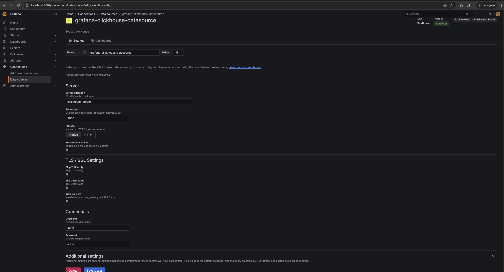

# Exploring CoffeeAGNTCY ☕️

Welcome! This hands-on tutorial combines **multiple reference apps** based on a fictitious coffee company navigating supply chain use cases to showcase how components in the **AGNTCY Internet of Agents** are meant to work together.

You will:

1. Interact with **three demos** (Lungo Auction, Lungo Logistic, Corto Sommelier)
2. Spin up each demo with docker compose
3. Use **preconfigured prompts** (and your own)
4. Explore **traces and metrics** 

## 🧰 Prerequisites

- **Docker** + **Docker Compose**
- **Node.js ≥ 16.14.0** (if you run any UI locally outside of Docker)
- **uv** (Python environment manager)

Clone the CoffeeAGNTCY repository:
```bash
git clone https://github.com/agntcy/coffeeAgntcy.git
cd coffeeAgntcy
```

## 🗂️ Repo Layout (Reference)

```
coffeeAGNTCY/
  coffee_agents/
    corto/
      exchange/           # Exchange API + UI
      farm/               # Farm A2A server
      docker-compose.yml. # Corto Docker Compose

    lungo/
      agents/
        supervisors/      # Auction and Logistic supervisors
        farms/            # Brazil/Colombia/Vietnam farms
        logistics/        # Logistics farm, accountant, helpdesk, and shipper
        mcp_servers/      # Weather MCP server
      docker-compose.yml. # Lungo Docker Compose
```

## Corto Sommelier

### 1. Setup

Copy and configure your environment:
```bash
cp .env.example .env
```

Edit `.env` with your API keys and provider (OpenAI or Azure). 

OpenAI:
```env
LLM_PROVIDER=openai
OPENAI_API_KEY="your_openai_api_key_here"
OPENAI_ENDPOINT=https://api.openai.com/v1
OPENAI_MODEL_NAME=gpt-4o
```
Azure OpenAI:
```env
LLM_PROVIDER=azure-openai
AZURE_OPENAI_ENDPOINT=https://your-azure-resource.openai.azure.com/
AZURE_OPENAI_DEPLOYMENT=your_azure_deployment_name
AZURE_OPENAI_API_KEY=your_azure_api_key
AZURE_OPENAI_API_VERSION=your_azure_openai_version
```

### 2. Launch the Demo Stack
All workshop services are containerized — start everything with one command:

```bash
docker compose up --build
```

This will start:
- The **Exchange** and **Farm** agents  
- The **UI** frontend
- The **SLIM and NATS message buses** for agent-to-agent communication  
- The **observability stack** (Grafana, OTEL Collector, ClickHouse)

Once containers are running, open:

- **Sommelier Demo:** [http://localhost:3000/](http://localhost:3000/)   
- **Grafana Dashboard:** [http://localhost:3001/](http://localhost:3001/)

### 3. Interact with the Demos

Send prompts to the agentic system.  
Predefined prompts are provided to help you start — but you can also type your own.

#### Sommelier Demo (Agent to Agent Pattern)

This demo showcases an **Exchange Agent** that communicates with a **Farm Agent**, which acts as a virtual Coffee Sommelier. When queried, the Farm Agent provides detailed flavor profiles for specific coffees.

**Exchange Agent:** A2A client  
**Farm Agent:** LangGraph-orchestrated A2A server  

The two agents communicate via the **SLIM message bus**. You can explore SLIM integrations in the following source files within the app-sdk repository:

- [`exchange/agent.py`](./coffeeAGNTCY/coffee_agents/corto/exchange/agent.py)  
- [`farm/farm_server.py`](./coffeeAGNTCY/coffee_agents/corto/farm/farm_server.py)

**Example prompts:**
- `What are the flavor profiles of Ethiopian coffee?`
- `What does coffee harvested in Colombia in the summer taste like?`

As you run the demo, observe in your Docker Compose logs how:
- The **supervisor** delegates to the **Farm Agent** over SLIM using the A2A protocol.


### 4. Inspect Traces in Grafana

Once you’ve executed a few prompts:

1. Go to [http://localhost:3001/](http://localhost:3001/)
2. Log in with:
   ```
   Username: admin
   Password: admin
   ```
3. Connect/Add the ClickHouse Datasource
   - In the left sidebar, click on **"Connections" > "Data sources"**.
   - If not already present, add a new **ClickHouse** datasource with the following settings:
     - **Server address:** `clickhouse-server`
     - **Port:** `9000`
     - **Protocol:** `native`
     - **User/Password:** `admin` / `admin`
   - If already present, select the **ClickHouse** datasource (pre-configured in the Docker Compose setup).

   
   
    
4. Import the OTEL Traces Dashboard 
   - In the left sidebar, click on **"Dashboards" > "New" > "Import"**.
   - Upload or paste the JSON definition for the OTEL traces dashboard, located here:  
     [`corto_dashboard.json`](coffeeAGNTCY/coffee_agents/corto/corto_dashboard.json)
   - **When prompted, select `grafana-clickhouse-datasource` as the datasource.**
   - Click **"Import"** to add the dashboard.

   
5. View Traces
   - Navigate to the imported dashboard.
   - You should see traces and spans generated by the Corto agents as they process requests.
   - **To view details of a specific trace, click on a TraceID in the dashboard. This will open the full trace and its spans for further inspection.**

   
   

### 5. Cleanup

When done, stop all containers:

```bash
docker compose down
```

## Lungo Auction & Logistics

### 1. Setup

If you tried out Corto Sommelier, copy the .env file from Corto to Lungo.
```bash
cp ../corto/.env .env
```

Or set up your .env from scratch:
```bash
cp .env.example .env
```

Edit `.env` with your API keys and provider (OpenAI or Azure). 

OpenAI:
```env
LLM_PROVIDER=openai
OPENAI_API_KEY="your_openai_api_key_here"
OPENAI_ENDPOINT=https://api.openai.com/v1
OPENAI_MODEL_NAME=gpt-4o
```
Azure OpenAI:
```env
LLM_PROVIDER=azure-openai
AZURE_OPENAI_ENDPOINT=https://your-azure-resource.openai.azure.com/
AZURE_OPENAI_DEPLOYMENT=your_azure_deployment_name
AZURE_OPENAI_API_KEY=your_azure_api_key
AZURE_OPENAI_API_VERSION=your_azure_openai_version
```
### 2. Launch the Demo Stack

All workshop services are containerized — start everything with one command:

```bash
docker compose up --build
```

This will start:
- The **Auction** and **Logistic** agents  
- The **UI** frontends 
- The **SLIM and NATS message buses** for agent-to-agent communication  
- The **observability stack** (Grafana, OTEL Collector, ClickHouse)

Once containers are running, open:

- **Auction and Logistic Demos:** [http://localhost:3000/](http://localhost:3000/)    
- **Grafana Dashboard:** [http://localhost:3001/](http://localhost:3001/)

### 3. Interact with the Demos

Each demo UI lets you send prompts to an agentic system.  
Predefined prompts are provided to help you start — but you can also type your own.

#### 🏷️ Auction Demo (Supervisor–Worker Pattern)

This app models a **Coffee Exchange** where a supervisor manages multiple coffee farm agents.

Example prompts:
- `Show me the total inventory across all farms`
- `How much coffee does the Colombia farm have?`
- `I need 50 lb of coffee beans from Colombia for 0.50 cents per lb`

Observe in your docker compose logs how:
- The supervisor delegates to individual farms  
- Responses aggregate across agents  
- Broadcast vs unicast messaging is handled automatically

#### 🚚 Logistic Demo (Coordination/ Group Chat Pattern)

This demo models a **supply coordination** scenario, where agents communicate laterally to optimize deliveries.

Example prompts:
- `I want to order coffee $3.50 per pound for 500 lbs of coffee from the Tatooine farm`

Notice how agents coordinate and negotiate amongst themselves in a group chat.

### 4. Inspect Traces in Grafana

Once you’ve executed a few prompts:

1. Go to [http://localhost:3001/](http://localhost:3001/)
2. Log in with:
   ```
   Username: admin
   Password: admin
   ```
3. **Connect/Add the ClickHouse Datasource**

   - In the left sidebar, click on **"Connections" > "Data sources"**.
   - If not already present, add a new **ClickHouse** datasource with the following settings:
     - **Server address:** `clickhouse-server`
     - **Port:** `9000`
     - **Protocol:** `native`
     - **User/Password:** `admin` / `admin`
   - If already present, select the **ClickHouse** datasource (pre-configured in the Docker Compose setup).

   
   

4. **Import the OTEL Traces Dashboard**

   - In the left sidebar, click on **"Dashboards" > "New" > "Import"**.
   - Upload or paste the JSON definition for the OTEL traces dashboard, located here:  
     [`lungo_dashboard.json`](coffeeAGNTCY/coffee_agents/lungo/lungo_dashboard.json)
   - **When prompted, select `grafana-clickhouse-datasource` as the datasource.**
   - Click **"Import"** to add the dashboard.

   

5. **View Traces**

   - Navigate to the imported dashboard.
   - You should see traces and spans generated by the Lungo agents as they process requests.
   - **To view details of a specific trace, click on a TraceID in the dashboard. This will open the full trace and its spans for further inspection.**

   
   
6. Explore:
   - **Trace timelines** showing how each agent processed your prompt  
   - **Span hierarchies** (Supervisor → Farm or Logistics Agents)  
   - Latencies and tool calls between components

> Tip: Click any **Trace ID** to open the full trace and visualize agent interactions end-to-end.

### 5. Cleanup

When done, stop all containers:

```bash
docker compose down
```

## Recap

In this workshop, you:
- Deployed Corto's **Sommelier** demo via Docker Compose which showed a 1-1 A2A connection over SLIM 
- Deployed Lungo’s **Auction** and **Logistic** demos via Docker Compose and explored supervisor-worker and group chat agentic patterns 
- Interacted with real-time **agentic UIs**  
- Observed communication traces in **Grafana**  
- Understood how different **A2A communication patterns** emerge from design
- Explored code that shows how agents integrate with **AGNTCY SLIM, Observe, & Agent Identity** components directly or via the **App SDK**

### 🔗 References
- [Agntcy App SDK](https://github.com/agntcy/app-sdk)
- [Observe SDK](https://github.com/agntcy/observe)