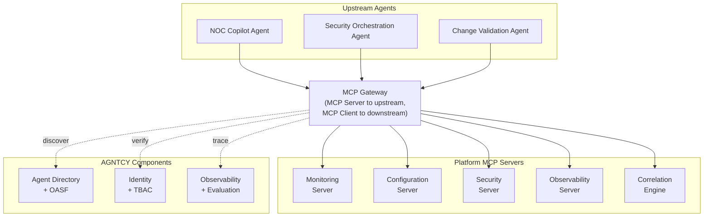
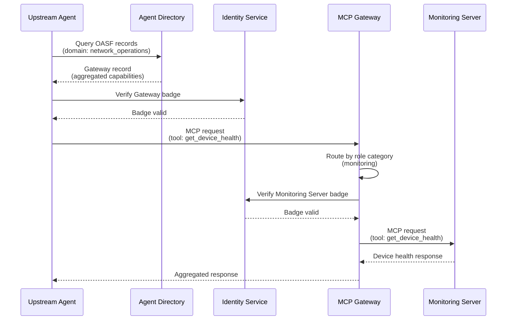
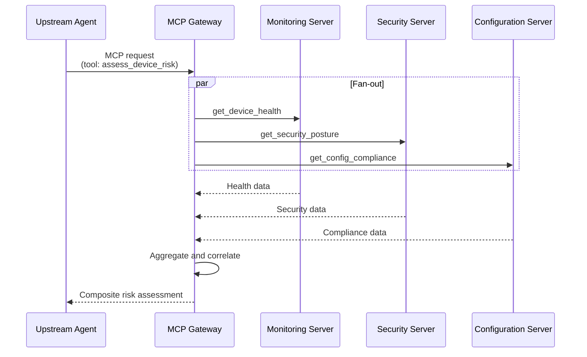
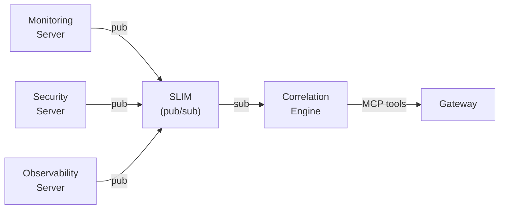
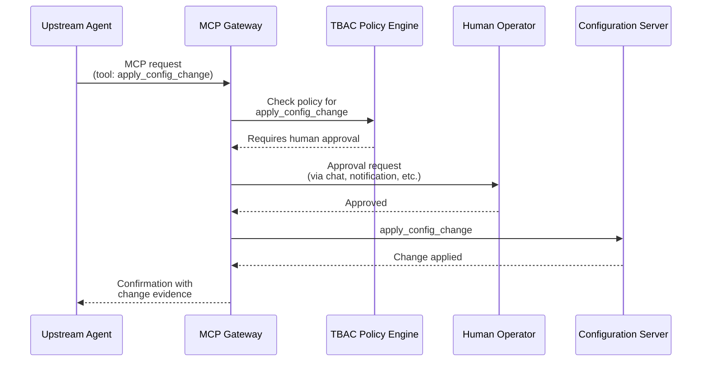
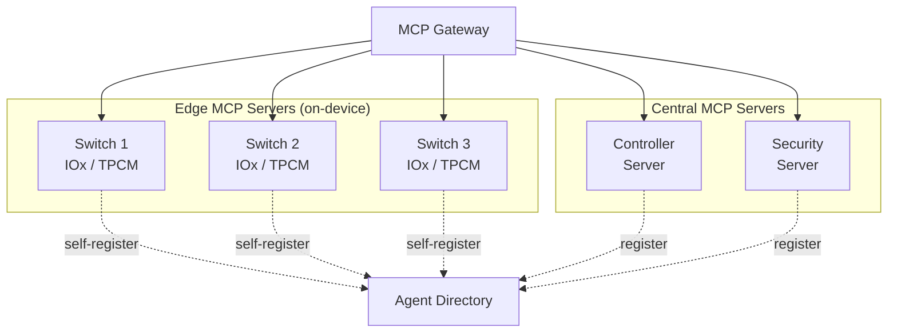
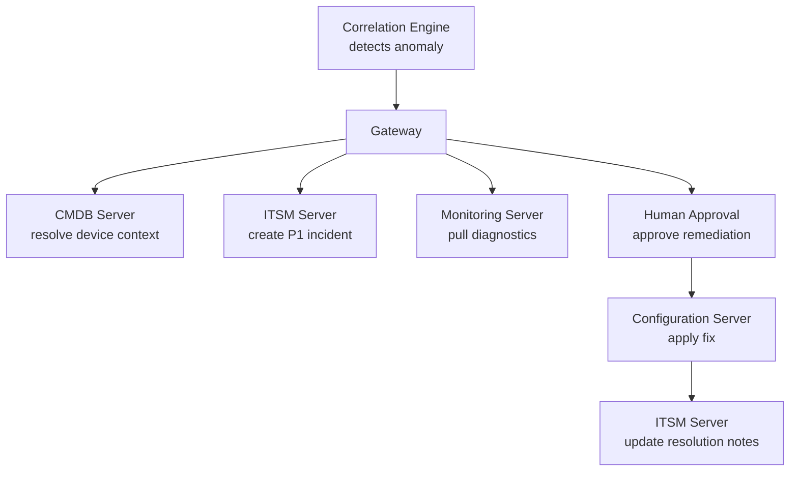
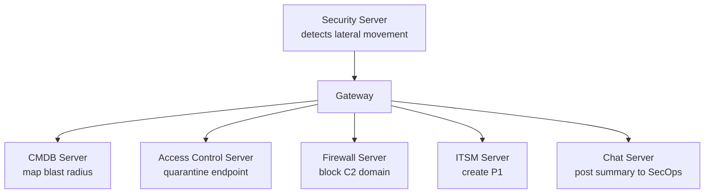
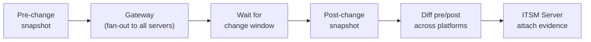

# Gateway Pattern: Multi-Platform MCP Aggregation

## Overview

The Gateway Pattern aggregates multiple MCP servers behind a single entry point,
enabling upstream agents to interact with heterogeneous platforms through a
unified discovery and routing layer. The gateway acts as an MCP server to
upstream consumers and an MCP client to each downstream platform server,
providing capability-based routing, cross-platform correlation, and
human-in-the-loop approval workflows.

This pattern addresses a gap in current MCP deployments: while individual MCP
servers expose tools for single platforms, enterprise environments typically
operate dozens of platforms that must be queried, correlated, and acted upon
together. The Gateway Pattern composes AGNTCY's core components - Agent
Directory, OASF, Identity, TBAC, SLIM, and Observability - to solve this at
scale.

## Architecture

The gateway sits between upstream agents and downstream platform MCP servers.
Each platform gets its own dedicated MCP server process with independent
credentials, failure domains, and OASF records. The gateway discovers all
registered servers via the Agent Directory and routes requests by role category.

### Key Properties

- **Fan-out**: A single upstream request may invoke tools on multiple downstream
  servers. The gateway handles parallel dispatch and response aggregation.
- **Role-based routing**: Each downstream server registers with role categories
  (monitoring, configuration, security, observability, automation, compliance).
  The gateway routes based on role rather than server name, enabling
  substitution and extension without upstream changes.
- **Independent failure domains**: Each platform server is a separate process.
  A single server failure degrades capability without taking down the gateway.
- **Independent credentials**: Each server holds its own platform API
  credentials and its own Agent Badge. No shared secrets across servers.

## AGNTCY Component Mapping

| Gateway Capability | AGNTCY Component | Usage |
|---|---|---|
| Server discovery | Agent Directory + OASF | Each platform server registers an OASF record with role categories and tool lists. The gateway queries the Directory at startup and on schedule to discover available servers. |
| Identity verification | Identity + Verifiable Credentials | Each server holds an MCP Server Badge (W3C VC) with a DataIntegrityProof signed by the operating organization. The gateway verifies badges before routing requests. |
| Access control | TBAC | Policies define which upstream agents can invoke which tools on which downstream servers. Read-only agents cannot call configuration endpoints. |
| Cross-server messaging | SLIM | Platform servers publish telemetry events over SLIM (pub/sub). The correlation engine subscribes to all streams and fuses events across platforms. |
| Observability | Observability + Evaluation | Gateway and all platform servers export OpenTelemetry traces. Cross-platform request chains are correlated via trace context propagation through the gateway. |
| Agent descriptions | OASF | The gateway itself registers an OASF record that aggregates the capabilities of all downstream servers, presenting a unified skill and domain set to upstream consumers. |

## Communication Patterns

### Discovery and Routing

### Cross-Platform Fan-Out

For queries that span multiple platforms, the gateway fans out to multiple
servers in parallel:

### Telemetry Fusion via SLIM

Platform servers generate continuous telemetry that cannot be efficiently
delivered through synchronous MCP request/response. The pattern uses SLIM for
asynchronous telemetry delivery to a correlation engine.

The correlation engine has two input channels:

- **Asynchronous (SLIM pub/sub)**: Continuous telemetry feed from all platform
  servers, enabling real-time correlation without polling.
- **Synchronous (MCP)**: On-demand queries from the gateway when an upstream
  agent requests correlation analysis.

The correlation engine does not require a large language model. Rule-based
correlation (entity overlap + time windows), statistical anomaly detection, and
expert-curated templates provide deterministic, explainable results without
model inference overhead.

### Human-in-the-Loop Approval

State-changing operations require human approval. TBAC policies enforce approval
gates at the tool level.

TBAC policies can be configured at multiple granularity levels:

- **Per-tool**: `apply_config_change` always requires approval.
- **Per-server**: All write operations on the Configuration Server require
  approval.
- **Per-agent**: The Compliance Auditor agent has read-only access to all
  servers regardless of tool.
- **Conditional**: Approval required only when blast radius exceeds a threshold.

## Topology Variants

### Centralized (Default)

Platform MCP servers run centrally and communicate with controllers, dashboards,
and cloud platforms via their APIs. Best for fleet-wide analytics, policy
management, and environments where controller APIs are the primary integration
point. This is the topology described above.

### Edge-Native

MCP servers run on the network devices themselves using on-device container
runtimes. Each device self-registers in the Agent Directory via its OASF record.
Best for survivability during controller outages, low-latency device-local
queries, and access to state that controllers do not expose.

Supported platforms include any network device with an embedded container
runtime:

- Cisco Catalyst 9000 series via IOx
- Dell PowerSwitch via Third Party Container Management (TPCM) on Enterprise SONiC
- Whitebox switches running SONiC with native Docker support

### Hybrid

Both centralized and edge-native servers coexist. The gateway discovers all
servers through the same Agent Directory and routes by capability.
Controller-level queries (assurance scores, fabric health, policy compliance)
route to central servers. Device-level queries (interface counters, MAC tables,
config verification) route to edge servers. The correlation engine subscribes to
telemetry from both layers.

## Workflow Examples

### Closed-Loop Incident Management

The correlation engine detects a cross-platform anomaly, the gateway resolves
device context from the CMDB, creates an incident in the ITSM platform, pulls
diagnostics from monitoring, obtains human approval for remediation, applies the
fix, and updates the incident with resolution notes. Full lifecycle through a
single gateway.

### Security Orchestration

A security agent correlates lateral movement across platforms, calculates blast
radius via the CMDB, executes containment with human approval for destructive
actions, and posts a summary to the security operations channel.

### Change Validation

A change validation agent captures pre-change baselines across every platform,
waits for the maintenance window, validates post-change state, flags
regressions, and attaches before/after evidence to the change record.

## Building a Gateway with AGNTCY

1. **Create an MCP server per platform.** Each server wraps a single platform's
   API and exposes its capabilities as MCP tools. Each server runs as an
   independent process with its own credentials.

2. **Register OASF records.** Each platform server and the gateway itself
   register OASF records in the Agent Directory with appropriate domains, skills,
   and role metadata.

3. **Issue Identity Badges.** Each server receives an MCP Server Badge (W3C VC)
   from the operating organization. The gateway verifies badges during discovery
   before routing any requests.

4. **Define TBAC policies.** Create policies that specify which upstream agents
   can invoke which tools. Enforce human-in-the-loop approval for state-changing
   operations.

5. **Connect telemetry via SLIM.** Platform servers publish telemetry events
   over SLIM pub/sub. The correlation engine subscribes to all streams and
   exposes its findings as MCP tools.

6. **Instrument with OpenTelemetry.** Use the AGNTCY Observe SDK to export
   traces from the gateway and all platform servers. Propagate trace context
   through the gateway to enable cross-platform request correlation.

7. **Register the gateway in the Directory.** The gateway's OASF record
   advertises the aggregated capabilities of all downstream servers. Upstream
   agents discover the gateway through the Directory like any other service.

## Reference Implementation

[MIGA MCP Gateway](https://github.com/keewillidevnet/miga-mcp-gateway)
implements this pattern for Cisco infrastructure, aggregating 15 platform MCP
servers (Catalyst Center, Meraki, ThousandEyes, XDR, ISE, Security Cloud
Control, Duo, Nexus Dashboard, SD-WAN, AppDynamics, Splunk, Hypershield,
ServiceNow, NetBox) behind a single gateway with a correlation engine (INFER)
and a WebEx conversational interface. MIGA is available on the
[Cisco Code Exchange](https://developer.cisco.com/codeexchange/).
