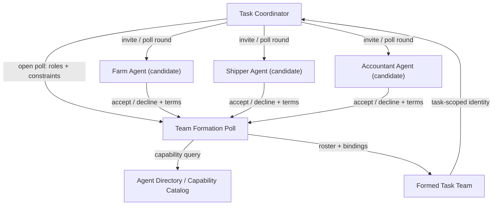

# Team Formation via Polling

## Agent Interaction Diagram

## Pattern

**References:**

- **Source:** CoffeeAGNTCY pattern library (this document).
- **Inspired by:** Antonio Gullí, *Agentic Design Patterns* (Springer, 2025), Ch. 7 - Multi-Agent Collaboration (Hierarchical model) and
  Ch. 21 - Exploration and Discovery. [https://doi.org/10.1007/978-3-032-01402-3](https://doi.org/10.1007/978-3-032-01402-3)

**Category:** Internet of Cognition

**Team formation via polling** assembles a **task-scoped coalition** of agents when the right participants are not
known upfront. A coordinator publishes a **poll**: required **roles**, **capabilities**, **constraints** (region,
currency, SLA), and a **deadline**. Candidate agents **accept or decline** with optional terms; the poll engine
closes with a **roster** - who is on the team for *this* task - and **bindings** (handles, endpoints, commitment window).

The cognitive artifact is not message traffic but the **formed team record**: a queryable structure every participant
and downstream agent can read ("Who is the shipper for order X?", "Is finance in the coalition yet?"). That record
**outlives individual poll messages** and **precedes** execution of the workflow.

Typical ingredients:

- **Role slots** - e.g. farm, shipper, finance-each with capability requirements.
- **Polling rounds** - initial broadcast, reminders, early close on quorum, or timeout with partial team.
- **Accept/decline semantics** - agents reveal availability and terms without exposing full private reasoning.
- **Team identity** - a stable team or coalition id referenced by shared memory, intent registry, and transport rooms.

This pattern is **not** the same as:

- **Directory-Based Dispatch** - one-shot routing to a known agent; team formation **builds a set** over time.
- **Recruiter** - evaluates and ranks agents for capability fit; this pattern is **explicit join/decline** with a published roster.
- **Shared Agent Memory** - stores operational facts during execution; the team record is **who is allowed in the room**.
- **Shared Intent Registry** - holds goal and constraints; team formation holds **membership and role bindings**.

The pattern transfers wherever tasks need **dynamic staffing**: incident bridges, cross-vendor fulfillment, seasonal
harvest surges, or any workflow where the same topology template must be **instantiated** with different agents each run.

---

## Use case

**Coffee Agntcy** is a coffee company set in a familiar supply chain: **upstream**, it depends on **farms in different
countries**, each with its own harvest rhythm, quality, and availability; **midstream**, it **buys and allocates** lots-
matching supply to commercial needs under real constraints; **downstream**, it must eventually **honor customer
promises** through operations, logistics, and finance it does not always own end to end. The company sits **between**
those worlds: much of the drama is ordinary commerce-contracts, risk, partners, and tools-rather than a single team
inside one building holding every fact.

When Coffee Agntcy needs a short-lived coalition for a harvest window or a tender, the roster is not a standing
org chart. **Team formation via polling** asks capable agents to declare availability and lets the initiator pick
a task-scoped group from those replies. Directory dispatch finds a known specialist; this pattern first discovers
who can join, then binds that set for the work at hand.

---

## Scenario

A **rush order** needs a **fresh coalition**: Tatooine farm, a shipper with cold-chain capacity, and finance for
pre-payment terms. The logistics coordinator cannot hard-code agents-farms rotate availability and shippers reassign
lanes.

**Without team formation via polling**

- The coordinator **messages candidates one by one** in chat order; two shippers both commit, finance never answers,
  and nobody knows the official roster.
- **Late joiners** start work without knowing who else accepted; duplicate or conflicting actions follow.
- After a restart, **membership exists only in message history**.

**With team formation via polling**

- Coordinator opens a poll: roles `{farm, shipper, finance}`, constraints `{region: Tatooine, cold_chain: true}`.
- Candidates accept/decline; poll closes with roster `team://order-8842` binding agent ids to roles.
- Group chat, shared memory, and intent registry all **cite the same team id** before execution starts.

---

## Workflow

**Task Coordinator** (e.g. Logistics Agent Buyer) opens the poll when a user prompt requires multi-party fulfillment,
writes the poll spec, and monitors quorum. On close it **retains** the roster to shared memory and opens the
group channel with only accepted members.

**Team Formation Poll** maintains poll state, enforces deadlines, validates role fills, and emits the
**Formed Task Team** record. A workflow table, directory callbacks, or similar store can back the same poll lifecycle.

**Candidate agents** respond with `accept` / `decline` and optional terms (earliest ship date, fee cap). They read the
final roster before joining transport rooms.

**Agent Directory** supplies capability metadata for invitations but does not replace the poll's **commitment**
semantics.

**Flow in one breath**

1. Coordinator publishes poll with roles and constraints.
2. Registry narrows candidates; coordinator invites or broadcasts poll round.
3. Agents accept/decline until quorum or timeout.
4. Poll closes → **team record** published → shared memory / group messaging / intent registry reference `team id`.
5. Execution proceeds with a **single queryable coalition** every agent can recall.
