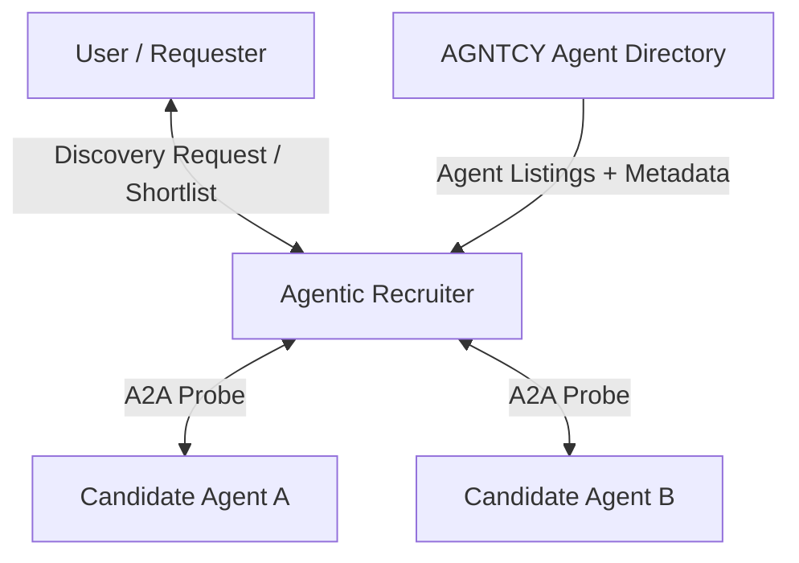

# A2A HTTP

## Agent Interaction Diagram

## Pattern

**Recruiter-style discovery** is a general pattern for **on-demand selection** in an ecosystem of many possible
**agents, services, or tools**: one **recruiter** (or selector) turns a vague ask into **structured lookup**,
**ranking**, and a **small, explainable answer**—who exists, what they offer, whether they are eligible—then hands
results to a person or to a **downstream** process that will actually run the work.

Structurally it usually sits on **supervisor-and-workers** bones: **one coordinator**, a few **clear callees**. The
special emphasis is **discovery semantics**, not day-to-day execution: the center of gravity is **choice**, not
long-running multi-party negotiation.

Typical responsibilities:

- The **recruiter** parses intent, queries a **directory or registry**, may **probe** candidates with bounded calls
  (health checks, schema fetches), **scores** and **filters**, and narrates **trade-offs** in one voice.
- The **directory** is the **system of record** for what can be discovered: identities, skills, interfaces, trust
  metadata, lifecycle. It answers **read-mostly** lookups and stays **cheap to query**; it does **not** replace human or
  policy judgment about who should win.
- **Optional candidate agents** appear when the recruiter needs live verification; any execution of real work is usually
  **deferred** to another episode once a shortlist exists.

Typical wiring:

- **Recruiter → directory** — filters, facets, lists; cache-friendly where possible.
- **Recruiter → candidate** — short, purpose-bound probes when needed.
- **Results → user** — always **through the recruiter** so the outcome reads as **one coherent story** (what matched,
  why, what to do next).

The topology is a **star toward selection**: a registry spoke plus optional candidate spokes, with **selection logic**
owned in one place so allow-lists, scoring, consent, and rate limits stay **auditable**.

That shape transfers anywhere a firm must **shop inside a bounded catalog**—API marketplaces, internal service meshes,
partner networks—without hard-coding every endpoint for every new question.

---

## Use case

**Coffee Agntcy** is a coffee company set in a familiar supply chain: **upstream**, it depends on **farms in different
countries**, each with its own harvest rhythm, quality, and availability; **midstream**, it **buys and allocates** lots—
matching supply to commercial needs under real constraints; **downstream**, it must eventually **honor customer
promises** through operations, logistics, and finance it does not always own end to end. The company sits **between**
those worlds: much of the drama is ordinary commerce—contracts, risk, partners, and tools—rather than a single team
inside one building holding every fact.

---

## Scenario

**Capability discovery** is the chapter where the company asks **who or what in the wider network can do the job we need
next**. The scene is a **talent and tools counter**: **short, verifiable signal** about real agents, services, and
interfaces the firm might rely on soon.

**Voices and what they hold**

- The **agentic recruiter** holds the question, the **ranking logic**, and the obligation to **decline clearly** when
  nothing fits well enough.
- The **agent directory (registry)** holds **canonical listings**—names, capabilities, endpoints, and the plain metadata
  that separates a serious offer from rumor.

**Listings flow into judgment**: the directory **feeds** the recruiter facts; the recruiter **turns facts into a
shortlist and reasons**. That separation keeps accountability clear.

**How the beat is built**

1. **Name the gap** — articulate the missing capability in shape, constraints, time horizon, and risk band.
2. **Query the shelf** — pull **structured** answers from the directory so the desk starts from **registrations and
  facets**, not from memory alone.
3. **Winnow** — drop obvious mismatches early so attention stays on a small set of plausible fits.
4. **Stress-test survivors** — surface scope limits, failure modes, and who owns the pager when things break at night.
5. **Close the beat** — hand forward a **small set of credible matches** with **reasons**, ready for deeper diligence,
  watch-listing, or a clear **no**—each outcome defensible to procurement and engineering alike.

**What gives the scene weight**

Catalogs change; tags can be optimistic; ranking invites politics. Good discovery keeps **criteria visible**, prefers a
few **strong** options with falsifiable claims over a long list of **maybes**, and treats the episode as **procurement
of capability**—sober, bounded, and accountable.

---

## Workflow

**AGNTCY Agent Directory** is the **registry spoke**: the place where **agent cards** live—what is registered, under
which names, with which interfaces and limits. It answers the recruiter’s **lookups** and returns **facts** the selector
can sort, filter, and cite.

**Agentic Recruiter** is the **orchestration and judgment hub**: it receives **directory-backed listings**, applies
**policy and scoring**, may run **bounded probes** against candidates when the cards are not enough, and produces the
**user-facing narrative**—what matched, why those picks, what to do next.

The **relationship from directory to recruiter** encodes the story’s core rule: **listings flow into judgment**. Facts
travel **into** the recruiter so every recommendation remains **traceable** to registered metadata and explicit rules,
not to opaque intuition.

**Flow in one breath**

The directory **surfaces what exists**; the recruiter **chooses what matters now** and explains the choice—**on-demand
discovery** as a compact star: **registry in**, **short, trustworthy answer out**.