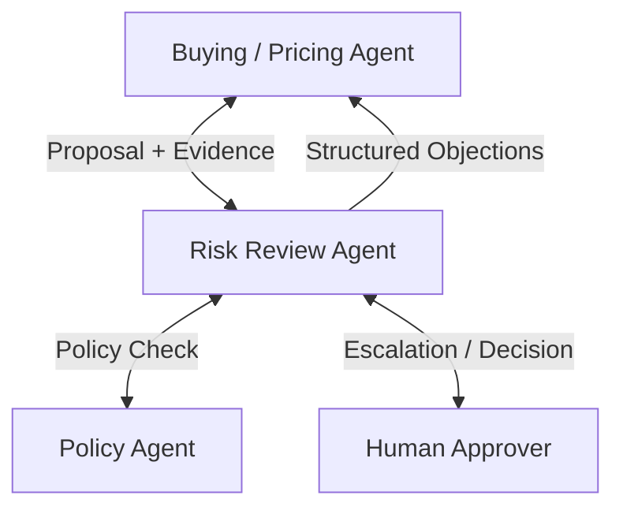

# Adversarial Review Agents

## Agent Interaction Diagram

## Pattern

**Adversarial review** is a way to force a **challenger voice** before expensive commitments: risk against optimism,
policy against shortcuts, so decisions survive contact with someone whose role is to **disagree constructively**. The
goal is not to stall forever, but to ensure assumptions and evidence are stress-tested while the trade space is still
wide enough to change course cheaply.

In a typical arrangement, a **proposer** publishes assumptions and evidence. A **critic** hunts for contradictions and
raises **structured objections**. Orchestration caps how many rounds run, decides when evidence is sufficient, and can
**escalate to people** when autonomy ends or stakes are too high for machines alone. That shape transfers to hiring,
procurement, safety sign-off, or any domain where a single optimistic narrative would be dangerous.

---

## Use case

**Coffee Agntcy** is a coffee company set in a familiar supply chain: **upstream**, it depends on **farms in different
countries**, each with its own harvest rhythm, quality, and availability; **midstream**, it **buys and allocates** lots—
matching supply to commercial needs under real constraints; **downstream**, it must eventually **honor customer
promises** through operations, logistics, and finance it does not always own end to end. The company sits **between**
those worlds: much of the drama is ordinary commerce—contracts, risk, partners, and tools—rather than a single team
inside one building holding every fact.

---

## Scenario

The company’s **risk** function should examine **long-term pricing** recommendations before the firm locks a curve that
cannot be unwound.

A **Workflow** section will describe how this pattern is realized once a concrete layout exists.
