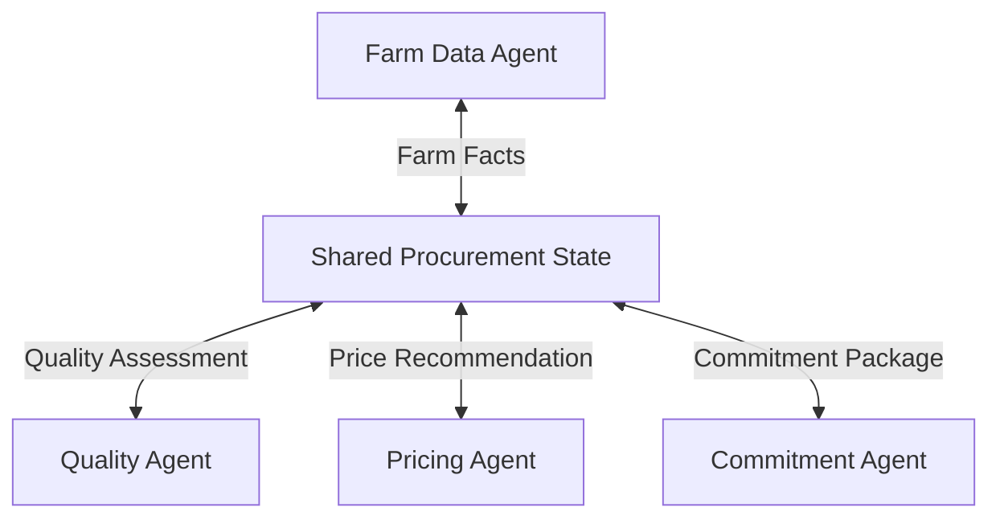

# Agent Workflow Chain

## Agent Interaction Diagram

## Pattern

**Agent workflow chain** means breaking a **complex goal into ordered agent steps**, each enriching **shared state** so
later specialists inherit constraints instead of rediscovering what earlier steps already established. The shared record
might hold quality floors, commercial bands, diligence flags, or other structured facts that every hop must respect.

Steps usually run **in sequence** or in a **shallow directed acyclic graph**: each step reads the same evolving record
and writes its slice back under an agreed schema before the next agent runs. That keeps accountability clear (who added
what), makes replay and auditing feasible, and avoids duplicate work across the chain. The idea applies wherever work
naturally decomposes into ordered specialties—onboarding, incident response, or multi-stage approval—without collapsing
everything into one monolithic prompt.

---

## Use case

**Coffee Agntcy** is a coffee company set in a familiar supply chain: **upstream**, it depends on **farms in different
countries**, each with its own harvest rhythm, quality, and availability; **midstream**, it **buys and allocates** lots—
matching supply to commercial needs under real constraints; **downstream**, it must eventually **honor customer
promises** through operations, logistics, and finance it does not always own end to end. The company sits **between**
those worlds: much of the drama is ordinary commerce—contracts, risk, partners, and tools—rather than a single team
inside one building holding every fact.

---

## Scenario

The familiar picture is **procurement**: **farm data**, then **quality**, then **pricing**, then **commitment**—each hop
adds something the firm can show a buyer, a grower, or finance without embarrassment.

A **Workflow** section will describe how this pattern is realized once a concrete layout exists.
