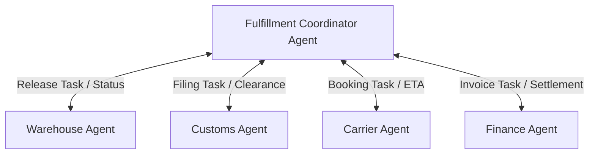

# Coordinator + Worker Agents

## Agent Interaction Diagram

## Pattern

**Coordinator and worker** arrangements **separate planning from execution**: one agent keeps the work breakdown,
sequencing, and completion story while **specialists** perform **bounded slices** (warehouse, customs, carriers, or
similar) without each owning the full saga end to end.

The **coordinator** assigns tasks, tracks status, and reconciles outcomes. **Workers** return **structured results** so
retries, escalations, and “done” semantics stay legible under workflow and identity rules. That is the standard shape
for operations that span many departments or partners but still need one place that knows the overall state of the job.

---

## Use case

**Coffee Agntcy** is a coffee company set in a familiar supply chain: **upstream**, it depends on **farms in different
countries**, each with its own harvest rhythm, quality, and availability; **midstream**, it **buys and allocates** lots—
matching supply to commercial needs under real constraints; **downstream**, it must eventually **honor customer
promises** through operations, logistics, and finance it does not always own end to end. The company sits **between**
those worlds: much of the drama is ordinary commerce—contracts, risk, partners, and tools—rather than a single team
inside one building holding every fact.

---

## Scenario

**Order fulfillment** fits naturally: someone must **orchestrate** releases, filings, and bookings while each function
still speaks its own operational language.

A **Workflow** section will describe how this pattern is realized once a concrete layout exists.
