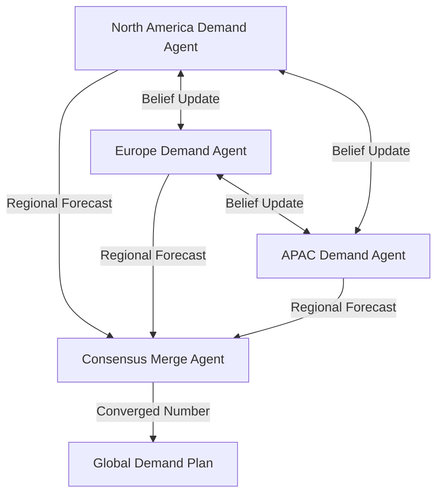

# Decentralized Consensus Agents

## Agent Interaction Diagram

## Pattern

**Decentralized consensus** aims to **reach agreement without a single permanent hub**: local agents exchange beliefs
and evidence until a forecast, allocation, or similar outcome **converges** under explicit stopping rules. No one node
is the eternal oracle; instead, the process is defined by **what may be published**, **how updates merge**, and **when
to stop**.

**Regional peers** publish and revise; transport and merge semantics must handle **oscillation and gaming**
deliberately—through caps, dampening, voting rules, or human tie-breaks—rather than hoping the graph settles on its own.
The pattern suits settings where many partial views must still roll up to **one executable number or decision** the
organization can act on.

---

## Use case

**Coffee Agntcy** is a coffee company set in a familiar supply chain: **upstream**, it depends on **farms in different
countries**, each with its own harvest rhythm, quality, and availability; **midstream**, it **buys and allocates** lots—
matching supply to commercial needs under real constraints; **downstream**, it must eventually **honor customer
promises** through operations, logistics, and finance it does not always own end to end. The company sits **between**
those worlds: much of the drama is ordinary commerce—contracts, risk, partners, and tools—rather than a single team
inside one building holding every fact.

---

## Scenario

The **regional demand** picture is the table vignette: many partial views still have to add up to **one number the firm
can execute**.

A **Workflow** section will describe how this pattern is realized once a concrete layout exists.
