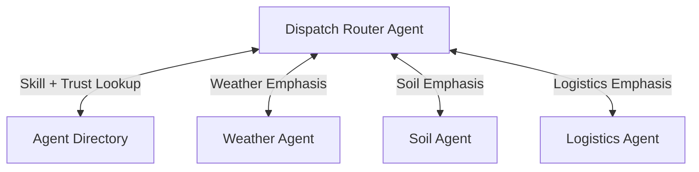

# Directory-Based Dispatch

## Agent Interaction Diagram

## Pattern

**Directory-based dispatch** chooses the **next specialist from intent and context** instead of hard-wiring a single
static path. When signals, tags, or confidence shift, a different expert may be the right callee; the pattern makes that
**explicit and explainable** rather than a hidden branch table.

A **router or lightweight orchestrator** consults **directory or catalog metadata**—skills, facets, trust labels—and
picks one or a few callees, recording **why** the choice was defensible. The directory is the operational map of who can
do what; dispatch logic stays auditable and can evolve as the roster grows.

---

## Use case

**Coffee Agntcy** is a coffee company set in a familiar supply chain: **upstream**, it depends on **farms in different
countries**, each with its own harvest rhythm, quality, and availability; **midstream**, it **buys and allocates** lots—
matching supply to commercial needs under real constraints; **downstream**, it must eventually **honor customer
promises** through operations, logistics, and finance it does not always own end to end. The company sits **between**
those worlds: much of the drama is ordinary commerce—contracts, risk, partners, and tools—rather than a single team
inside one building holding every fact.

---

## Scenario

When a **shipment anomaly** appears, the thread might need **weather**, **soil**, or **logistics** emphasis depending on
what the signals imply; the roster can grow without redeploying one giant fixed switch.

A **Workflow** section will describe how this pattern is realized once a concrete layout exists.
