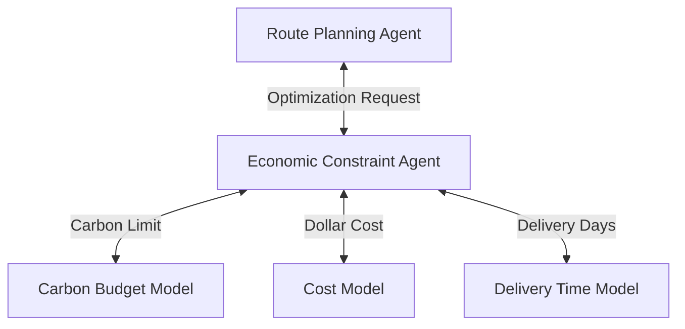

# Economic Constraint Agent

## Agent Interaction Diagram

## Pattern

An **economic constraint agent** optimizes under **explicit budgets**—cost, time, carbon, or other currencies—so
trade-offs are stated in the same units operations and finance already use. Decisions expose **Pareto fronts** (better
on one axis, worse on another) instead of pretending a single fake optimum exists when objectives genuinely conflict.

**Constraint models** hold versioned coefficients or rules; decision agents **query** them before committing routes or
spend. Outputs stay comparable across runs and teams. The pattern transfers wherever leadership insists that “cheaper,”
“faster,” and “greener” cannot each be maximized in isolation without saying what was sacrificed.

---

## Use case

**Coffee Agntcy** is a coffee company set in a familiar supply chain: **upstream**, it depends on **farms in different
countries**, each with its own harvest rhythm, quality, and availability; **midstream**, it **buys and allocates** lots—
matching supply to commercial needs under real constraints; **downstream**, it must eventually **honor customer
promises** through operations, logistics, and finance it does not always own end to end. The company sits **between**
those worlds: much of the drama is ordinary commerce—contracts, risk, partners, and tools—rather than a single team
inside one building holding every fact.

---

## Scenario

When **carbon budgets** bind, the firm can choose **greener shipping** with clear eyes on **days and dollars**.

A **Workflow** section will describe how this pattern is realized once a concrete layout exists.
