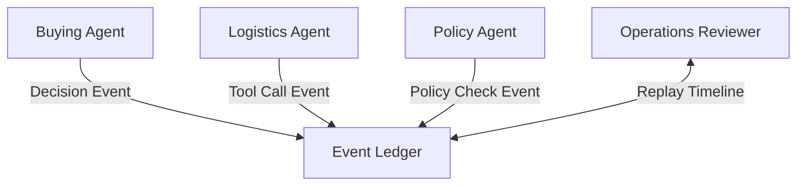

# Event Ledger (Episodic Memory)

## Agent Interaction Diagram

## Pattern

An **event ledger** (episodic memory for agents) appends a **faithful history of decisions**—prompts, tool calls, policy
checks—so teams can **replay** timelines after failure and see **which step** introduced a bad assumption. It is not a
marketing narrative; it is an ordered record suitable for audit and debugging.

Instrumented agents and tools emit **structured spans** into an observability backbone; **correlation** ties those spans
to business objects such as lots, orders, or shipments. The pattern answers the operations question: what did the system
actually do, in order, under which identities, when something went wrong?

---

## Use case

**Coffee Agntcy** is a coffee company set in a familiar supply chain: **upstream**, it depends on **farms in different
countries**, each with its own harvest rhythm, quality, and availability; **midstream**, it **buys and allocates** lots—
matching supply to commercial needs under real constraints; **downstream**, it must eventually **honor customer
promises** through operations, logistics, and finance it does not always own end to end. The company sits **between**
those worlds: much of the drama is ordinary commerce—contracts, risk, partners, and tools—rather than a single team
inside one building holding every fact.

---

## Scenario

When a **shipment fails**, operations wants the same story the machines already told, **end to end**—not a loose
summary.

A **Workflow** section will describe how this pattern is realized once a concrete layout exists.
