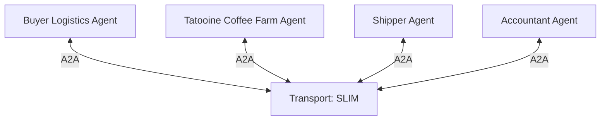

# Group Messaging

## Agent Interaction Diagram

## Pattern

**Group messaging and coordination** is a general arrangement when **several specialists** must **see the same
conversation**, **answer one another**, and still have **one accountable place** that keeps order, permissions, and
progress toward a shared goal. A **supervisor or moderator** opens a **shared channel**; **members** join as first-class
participants so clarifications, hand-offs, and corrections can flow **peer to peer**, not only through a strict hub in
fixed turn-taking.

Typical ingredients:

- A **shared conversation surface** (group, room, or thread) carries **visible messages** to everyone who belongs in
  that phase.
- **Publish–subscribe** style delivery to that surface so updates behave like **coordination in the open**—subscribers
  see the same evolving story instead of a pile of private side-chats.
- A **moderator** who can **phase** the discussion (for example from “facts on the ground” to “commitment” to
  “exception”) and intervene when the thread drifts or stalls.

**Secure group collaboration** layers **trust** on top of that shape: **authenticated membership**, **scoped messages**,
and **attributable speech** so the room feels like **intra-alliance work**—partners coordinating pricing, capacity, or
movement—rather than anonymous public posting. Security and transport together define **who may read**, **who may
write**, and **what may cross the boundary**, while the conversational pattern still allows **many-to-many** refinement
inside that boundary.

The combined idea transfers anywhere alliances must **negotiate under audit pressure**: crisis rooms, joint ventures,
regulated hand-offs between operations, carriers, and finance.

---

## Use case

**Coffee Agntcy** is a coffee company set in a familiar supply chain: **upstream**, it depends on **farms in different
countries**, each with its own harvest rhythm, quality, and availability; **midstream**, it **buys and allocates** lots—
matching supply to commercial needs under real constraints; **downstream**, it must eventually **honor customer
promises** through operations, logistics, and finance it does not always own end to end. The company sits **between**
those worlds: much of the drama is ordinary commerce—contracts, risk, partners, and tools—rather than a single team
inside one building holding every fact.

---

## Scenario

**Order fulfillment** is the chapter where the company must **deliver on a promise that already left the sales desk**—
coffee has a name, a quantity, a date, and a customer expectation. The scene is a **logistics war room**: functions that
do not normally share one sentence still have to **align on facts** before freight and money move.

**Voices and what they hold**

- The **buyer logistics lead** holds the customer-facing promise translated into operational asks: dates, splits,
  substitutions, and what “done” looks like on arrival.
- The **logistics group room** holds the **shared air** where those asks stop being private fragments and become **one
  visible thread** everyone can correct.
- The **Tatooine estate (supply)** holds ground truth on what can leave the farm or hand-off point: lots, condition, and
  what “ready” really means on the ground.
- The **shipper (movement)** holds carriage reality—bookings, dwell, weather at sea or road, and the cost of changing a
  lane after optimism.
- The **accountant (money)** holds invoice shape, payment timing, and whether the commercial story still matches margin
  after freight and fees land.

The lead’s work is to keep those voices **narrating one order**, not three incompatible stories.

**How the beat is built**

1. **Open with the promise** — what was sold, to whom, by when, and where flexibility lives if the world disagrees.
2. **Bring supply and movement into the same breath** — the estate speaks **availability and release**; the shipper
   answers **how it moves**; both feed one operational picture the group can see.
3. **Let updates clear through one shared lane** — reversals and corrections stay **in the open thread** so nobody
   optimizes against a truth others never saw.
4. **Pull finance in as movement hardens** — the accountant tests whether the plan still **pays** and **posts** cleanly;
  surprises surface **inside the room**, not only after the fact.
5. **Close the beat** — ship as planned, re-cut the plan honestly, or stop the clock with a clear exception—leaving a
   **single story of stock, movement, and settlement** that could be read back to a buyer without embarrassment.

**What gives the scene weight**

Inventory and freight must meet; finance must recognize what operations claim; silence in the shared thread becomes its
own risk. When those pressures read as ordinary operations, the scenario is grounded in **cross-functional alignment**
under a customer deadline.

---

## Workflow

**Logistics Group** is the **bounded collaboration scope**: the secure group in which membership, visibility, and
attribution apply. It frames this episode as **alliance-style logistics**—partners and internal roles that may question
each other **in the open** yet stay inside a trusted envelope.

**Buyer Logistics Agent** connects into **Transport** as the voice of the **customer promise**. It carries dates,
splits, substitutions, and the definition of “done” so the thread always remembers **what success means** for the person
waiting on the other end.

**Tatooine Coffee Farm Agent** also connects into **Transport**, bringing **supply-side truth** into the same shared
lane as the buyer logistics voice. Supply and demand-side facts therefore **meet in one observable stream** rather than
as disconnected private messages.

**Transport** is the **secure messaging fabric** linking the buyer and estate into the rest of the episode. From there
it reaches **Shipper Agent** and **Accountant Agent**, so **movement** and **money** each receive the **same evolving
context** the room has been building: availability, intent to ship, and the commercial frame that finance must honor.

**Shipper Agent** holds **carriage reality**—lanes, cutoffs, breakage, and the price of replanning—while staying tied to
the shared narrative the group has established.

**Accountant Agent** holds **settlement reality**—what will invoice, when cash moves, and whether margin survives the
fees and choices already visible in the thread.

**Flow in one breath**

The **logistics group** names the trusted boundary; **buyer logistics** and **Tatooine** publish into **transport** so
supply and promise reconcile in public; **shipper** and **accountant** consume that same stream to answer **how it
moves** and **how it pays**—order fulfillment as **group messaging** where alignment is the product.