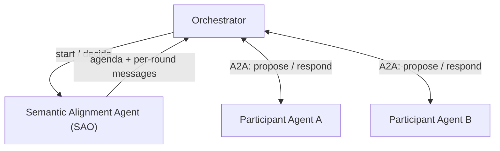

# Mediated Semantic Alignment

## Agent Interaction Diagram

## Pattern

**Mediated semantic alignment** gets independent agents to agree on **what terms mean** before they act on them. A
central **Semantic Alignment Agent**, built on the **SAO (Stochastic Alternating Offers)** mechanism, runs
**IntentDiscovery** and **OptionsGeneration** to turn a plain-language goal into a shared **agenda**: a set of
**issues**, each carrying a set of **options**. It then evaluates each round's **decisions** and detects **agreement**,
but it never calls the participating agents itself.

The distinguishing move is **caller mediation**. An **orchestrator** drives the engine's `start` then `decide` round
loop and bridges the engine to the participants over A2A. Each round the engine emits one message per participant; the
orchestrator dispatches each to the right agent, collects every reply, and posts them back together. Because the engine
only ever sees structured **offers**, each participant keeps its own reasoning **private**: an agent decides `accept`,
`reject`, or `counter_offer` on its own terms and reveals only the chosen option, never the logic behind it.

Roles alternate by round. One participant is the **proposer** and must put terms on the table via `counter_offer`; the
rest are **responders** and react to the standing offer. The loop continues until the session reaches a terminal state,
**agreed**, **broken**, or **timeout**, at which point the engine returns a validated final agreement with one chosen
option per issue plus coherence and alignment scores. The pattern transfers wherever independent parties must reconcile
vocabulary before committing: cross-vendor procurement, standards negotiation, service-level agreements, or any setting
where "we agreed" must mean the same thing to everyone who signed.

---

## Use case

**Coffee Agntcy** is a coffee company set in a familiar supply chain: **upstream**, it depends on **farms in different
countries**, each with its own harvest rhythm, quality, and availability; **midstream**, it **buys and allocates** lots,
matching supply to commercial needs under real constraints; **downstream**, it must eventually **honor customer
promises** through operations, logistics, and finance it does not always own end to end. The company sits **between**
those worlds: much of the drama is ordinary commerce, contracts, risk, partners, and tools, rather than a single team
inside one building holding every fact.

---

## Scenario

Coffee farms in **Brazil** and **Colombia** must agree on a **commodity price range** for coffee beans, expressed in
**USD per pound**. Left to plain messages the two would talk past each other: "a fair price," "the usual grade," and
"per pound" each hide different assumptions. Mediated semantic alignment forces those assumptions into an explicit
agenda first, what counts as the price range, which beans, which unit, so the farms negotiate over shared meaning
rather than over words that only look alike.

---

## Workflow

**Orchestrator** is the **caller** that owns the loop. It registers the participating agents as a multi-agentic system,
opens the session, and is the only component that ever talks to the agents. The engine stays a pure evaluator behind it.

**Semantic Alignment Agent** is the **SAO engine**. On `start` it runs **IntentDiscovery** and **OptionsGeneration** to
build the **agenda**, the issues to settle and the options available on each. On every `decide` it scores the round's
replies, advances the standing offer, and reports whether the session is still **ongoing** or has reached a terminal
state.

**Participant Agent A** and **Participant Agent B** are the **independent parties**. Each round the engine casts one as
**proposer** (must `counter_offer`) and the rest as **responders** (`accept`, `reject`, or `counter_offer`), and the
roles alternate. Each agent evaluates the offer against its own private economics and returns only its chosen action and
option.

**Flow in one breath**

1. The orchestrator calls `start` with the goal text and a step budget; the engine returns the agenda and the first
   round's messages.
2. The orchestrator dispatches each message to its agent over A2A and collects every reply.
3. The orchestrator posts the replies back with `decide`; the engine evaluates the round and returns either the next
   round's messages or a terminal status.
4. Steps 2 and 3 repeat until the session is **agreed**, **broken**, or **timeout**. On agreement the engine returns the
   final chosen option per issue with coherence and alignment scores, negotiation over shared meaning, mediated end to
   end by the caller.
