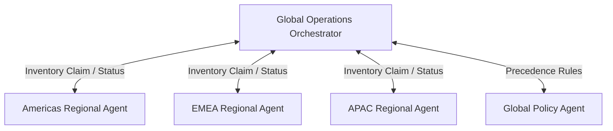

# Orchestrator Agent

## Agent Interaction Diagram

## Pattern

A **top-level orchestrator** coordinates, monitors, and governs **many workflows at once**: it resolves conflicts,
watches health, and keeps **global policy** from dissolving into regional habit. It does not replace every local
specialist; it provides a **single place** that sees parallel subgraphs (regions, lanes, product lines), merges status,
and applies rules about precedence, inventory claims, and escalation.

The pattern fits when several semi-independent flows could **step on each other**—double-selling capacity, conflicting
promises, or divergent interpretations of the same global constraint—unless something above them holds the whole map in
view.

---

## Use case

**Coffee Agntcy** is a coffee company set in a familiar supply chain: **upstream**, it depends on **farms in different
countries**, each with its own harvest rhythm, quality, and availability; **midstream**, it **buys and allocates** lots—
matching supply to commercial needs under real constraints; **downstream**, it must eventually **honor customer
promises** through operations, logistics, and finance it does not always own end to end. The company sits **between**
those worlds: much of the drama is ordinary commerce—contracts, risk, partners, and tools—rather than a single team
inside one building holding every fact.

---

## Scenario

The **global operations** voice is who notices when two regions promise the same bags to two customers.

A **Workflow** section will describe how this pattern is realized once a concrete layout exists.
