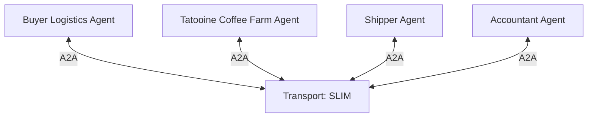

# Peer Group

## Agent Interaction Diagram

## Pattern

> **TODO** — full pattern-level write-up. This is a minimal stub so the pattern reference library has reachable
> reference material for the **Peer Group** pattern; a follow-up issue will replace this with the proper authored
> doc.
>
> **Status: API-only.** This doc is served via `POST /patterns/{name}/chat` for the implemented
> **Peer Group** pattern, but implemented patterns are not yet shown in the Reference Library sidebar
> (which currently lists only unimplemented placeholder patterns). Wiring implemented patterns into the
> Reference Library is tracked as a follow-up.

The **Peer Group** pattern wires several agents into a **flat, group-addressable conversation** rather than routing
everything through a central orchestrator. Every participant can publish and subscribe on the shared channel; the
group itself is the coordination surface.

In CoffeeAGNTCY this pattern backs the **Group Messaging** workflow under the **Coffee Agntcy → Order Fulfillment**
scenario — the diagram above is from that implementation and is included here as illustrative topology while the
full pattern-level write-up is pending.

See the per-workflow reference doc for the concrete implementation:

- [Group Messaging](./group_messaging.md)
