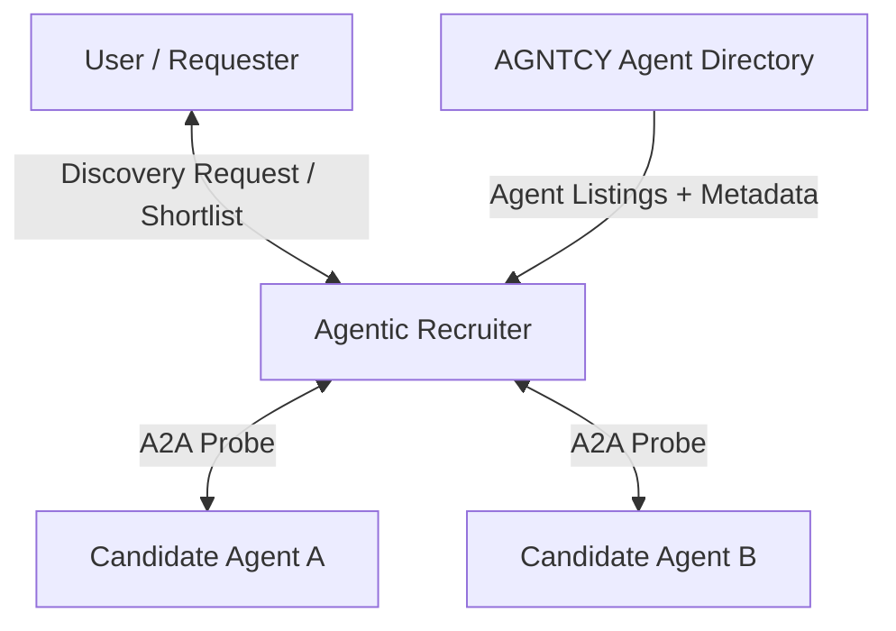

# Recruiter

## Agent Interaction Diagram

## Pattern

> **TODO** — full pattern-level write-up. This is a minimal stub so the pattern reference library has reachable
> reference material for the **Recruiter** pattern; a follow-up issue will replace this with the proper authored
> doc.

The **Recruiter** pattern handles **on-demand selection** in an ecosystem of many possible agents, services, or
tools. A single recruiter parses intent, queries a **directory or registry**, optionally **probes** candidates with
bounded calls, **scores** and filters, and produces a small, explainable shortlist with reasons.

In CoffeeAGNTCY this pattern backs the **A2A HTTP** workflow under the **Coffee Agntcy → Capability Discovery**
scenario — the diagram above is from that implementation and is included here as illustrative topology while the
full pattern-level write-up is pending.

See the per-workflow reference doc for the concrete implementation:

- [A2A HTTP](./a2a_http.md)
