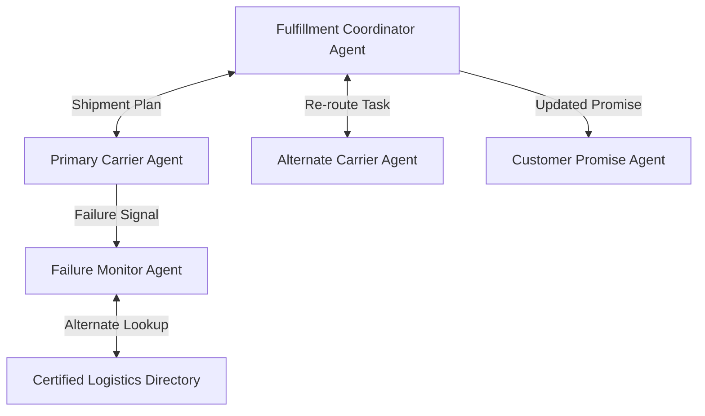

# Resilience & Re-Routing

## Agent Interaction Diagram

## Pattern

**Resilience and re-routing** recovers from failure by **switching agents or paths**: discover alternates, compensate
partial work, and keep customer promises from collapsing because one carrier or one integration had a bad day. Recovery
is **designed**, not heroic improvisation.

Monitors classify faults; **directory-assisted routing** finds qualified replacements; orchestration defines **retries**
and **honest customer messaging** when the original plan cannot be salvaged. The pattern applies wherever single points
of failure are inevitable but the customer-facing story must still land.

---

## Use case

**Coffee Agntcy** is a coffee company set in a familiar supply chain: **upstream**, it depends on **farms in different
countries**, each with its own harvest rhythm, quality, and availability; **midstream**, it **buys and allocates** lots—
matching supply to commercial needs under real constraints; **downstream**, it must eventually **honor customer
promises** through operations, logistics, and finance it does not always own end to end. The company sits **between**
those worlds: much of the drama is ordinary commerce—contracts, risk, partners, and tools—rather than a single team
inside one building holding every fact.

---

## Scenario

When a **carrier fails**, the firm engages the **next certified logistics** option without pretending the first plan
never existed.

A **Workflow** section will describe how this pattern is realized once a concrete layout exists.
