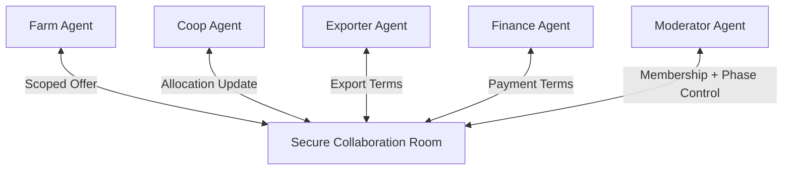

# Secure Group Collaboration

## Agent Interaction Diagram

## Pattern

**Secure group collaboration** lets **several agents coordinate inside a trusted boundary**: authenticated membership,
scoped messages, and attributable speech, so pricing and allocation feel like **intra-alliance work**, not an open
public forum. Security and transport define **who may read**, **who may write**, and **what may cross the boundary**.

Peers may **refine each other’s offers** within those controls; moderators can still **phase** the discussion when
threads risk drift. The combined idea transfers anywhere partners must negotiate under **audit pressure**—joint
ventures, crisis rooms, regulated hand-offs between operations, carriers, and finance.

---

## Use case

**Coffee Agntcy** is a coffee company set in a familiar supply chain: **upstream**, it depends on **farms in different
countries**, each with its own harvest rhythm, quality, and availability; **midstream**, it **buys and allocates** lots—
matching supply to commercial needs under real constraints; **downstream**, it must eventually **honor customer
promises** through operations, logistics, and finance it does not always own end to end. The company sits **between**
those worlds: much of the drama is ordinary commerce—contracts, risk, partners, and tools—rather than a single team
inside one building holding every fact.

---

## Scenario

**Farm, coop, exporter, and finance** need that room when numbers move money.

A **Workflow** section will describe how this pattern is realized once a concrete layout exists.
