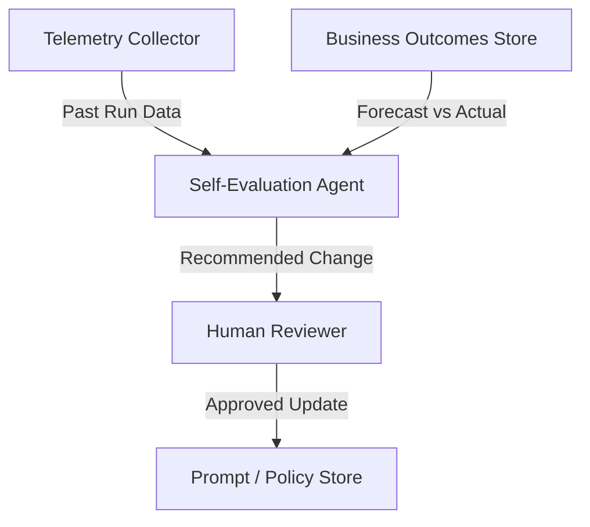

# Self-Evaluation Agent

## Agent Interaction Diagram

## Pattern

A **self-evaluation** (reflection) pattern compares **past outcomes** to intent—forecasts versus arrivals, routing
versus reality—and proposes **bounded improvements** to prompts, policies, or weights under **human governance**. The
agent reads telemetry and business results, compares them to what was supposed to happen, and outputs **reviewable
recommendations** instead of silently mutating production.

That keeps learning legible: someone can approve, reject, or defer changes, and auditors can see what evidence supported
a shift.

---

## Use case

**Coffee Agntcy** is a coffee company set in a familiar supply chain: **upstream**, it depends on **farms in different
countries**, each with its own harvest rhythm, quality, and availability; **midstream**, it **buys and allocates** lots—
matching supply to commercial needs under real constraints; **downstream**, it must eventually **honor customer
promises** through operations, logistics, and finance it does not always own end to end. The company sits **between**
those worlds: much of the drama is ordinary commerce—contracts, risk, partners, and tools—rather than a single team
inside one building holding every fact.

---

## Scenario

The **seasonal review** is the human-readable beat: did sourcing predictions earn their keep, and what should next
season do differently?

A **Workflow** section will describe how this pattern is realized once a concrete layout exists.
