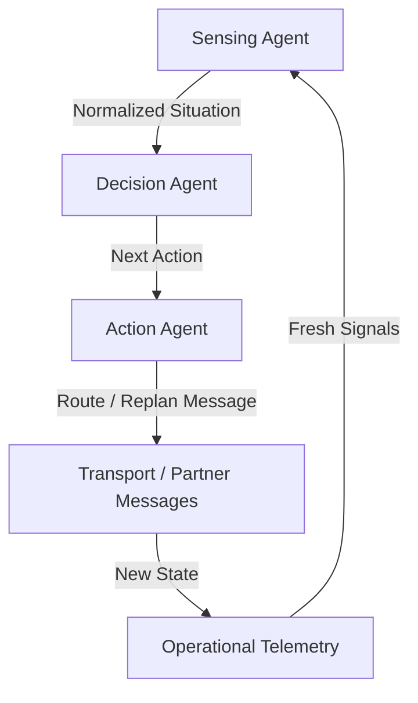

# Sense–Decide–Act Loop

## Agent Interaction Diagram

## Pattern

The **sense–decide–act loop** runs **observe → act → re-evaluate** in cycles so plans update when the world moves—ports
stall, carriers roll bookings, quality signals shift—instead of treating the first guess as permanent truth.

**Sensing** normalizes telemetry and messages into a common picture. **Deciding** picks the next small branch under
policy with current evidence. **Acting** changes state through tools or partner messages. Then the loop repeats with
fresh inputs. It is the control-theory backbone for operational agents in volatile environments.

---

## Use case

**Coffee Agntcy** is a coffee company set in a familiar supply chain: **upstream**, it depends on **farms in different
countries**, each with its own harvest rhythm, quality, and availability; **midstream**, it **buys and allocates** lots—
matching supply to commercial needs under real constraints; **downstream**, it must eventually **honor customer
promises** through operations, logistics, and finance it does not always own end to end. The company sits **between**
those worlds: much of the drama is ordinary commerce—contracts, risk, partners, and tools—rather than a single team
inside one building holding every fact.

---

## Scenario

During a **port strike**, the firm keeps rerouting and **re-scoring delivery risk** until there is either a credible
promise or an honest exception—not a single frozen plan.

A **Workflow** section will describe how this pattern is realized once a concrete layout exists.
