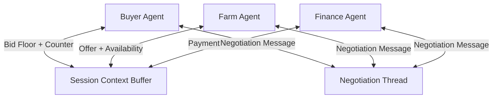

# Session Context Buffer

## Agent Interaction Diagram

## Pattern

A **session context buffer** is a **temporary, shared scratchpad** for one negotiation or task—bids, floors, deadlines,
last counters—without polluting long-term catalogs or treating ephemeral chatter as permanent truth. It answers: what is
the **current** state of this deal for everyone who is allowed in the room?

Participating agents read and write a **scoped session object** alongside the conversational thread. **Ownership,
time-to-live, and field-level permissions** keep the buffer honest and retirable when the deal closes or aborts. The
pattern fits auctions, RFQs, incident bridges—anywhere “where we are now” must be shared but not carved into stone
prematurely.

---

## Use case

**Coffee Agntcy** is a coffee company set in a familiar supply chain: **upstream**, it depends on **farms in different
countries**, each with its own harvest rhythm, quality, and availability; **midstream**, it **buys and allocates** lots—
matching supply to commercial needs under real constraints; **downstream**, it must eventually **honor customer
promises** through operations, logistics, and finance it does not always own end to end. The company sits **between**
those worlds: much of the drama is ordinary commerce—contracts, risk, partners, and tools—rather than a single team
inside one building holding every fact.

---

## Scenario

Live **origin negotiation** needs everyone to see the same “where we are now” until the handshake or walk-away moment.

A **Workflow** section will describe how this pattern is realized once a concrete layout exists.
