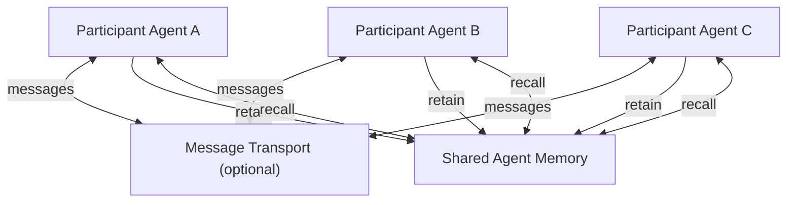

# Shared Agent Memory

## Agent Interaction Diagram

## Pattern

**Shared agent memory** gives multiple agents a **common place to read and write facts** about the work in progress—
task state, commitments, open questions, partial results—so they **build on each other's contributions** instead of
re-asking the same questions or re-sending the same data in every message.

In the wider agentic community this is the same family of ideas as **Shared Scratchpad Collaboration (SSC)**, the
**blackboard** pattern, and **multi-agent shared memory**: agents coordinate through **shared state**, not only through
point-to-point chat. One agent writes what it learned; others read it when they need it. The memory becomes the
**coordination surface**—who said what in messages matters less than **what the group now knows**.

Typical ingredients:

- A **scoped memory store** (per task, per workspace, or per multi-agent system) with clear **read/write rules**.
- **Structured or semi-structured updates**—facts with keys, timestamps, and **who wrote them**—not an unstructured
  pile of free text that agents overwrite by accident.
- **Recall by intent or query**—agents pull the slice they need ("What constraints are still open?") instead of receiving
  the full chat history on every turn.
- **Write once, read many**—a fact travels into memory **once**; every agent that needs it **reads from the store**
  instead of forcing a coordinator to relay the same payload again over the wire.

**Without** shared memory, coordination often degrades into **redundant transport**: a central agent becomes a
switchboard, repeating the same facts to every specialist; contributors **duplicate work** because they cannot see
prior outputs; a restarted agent **forgets** what the group already settled. **With** shared memory, participants keep a
**single evolving picture** of the task—fewer messages, less duplication, faster hand-offs.

This pattern is **not** the same as:

- **Group messaging** — messages are how agents *communicate*; shared memory is what they *remember together*.
- **Session context buffer** — a scratchpad for one live session; shared agent memory can **outlive a single thread**
  and serve agents that were not present when a fact first appeared.
- **Shared knowledge store** — curated, long-lived reference data; shared agent memory holds **operational state from
  the current run** (this task, this decision, this checkpoint).
- **Event ledger / telemetry** — an ordered trace for audit and replay; shared memory is **queryable working state** agents
  use to decide the next step (though traces can **feed** memory, as telemetry spans can).

The pattern transfers wherever specialists must **stay aligned on facts** under load: cross-functional task rooms,
incident bridges, multi-party workflows, or any setting where a settled fact should be **visible to the whole group**
without another round of relayed messages.

---

## Use case

**Coffee Agntcy** is a coffee company set in a familiar supply chain: **upstream**, it depends on **farms in different
countries**, each with its own harvest rhythm, quality, and availability; **midstream**, it **buys and allocates** lots—
matching supply to commercial needs under real constraints; **downstream**, it must eventually **honor customer
promises** through operations, logistics, and finance it does not always own end to end. The company sits **between**
those worlds: much of the drama is ordinary commerce—contracts, risk, partners, and tools—rather than a single team
inside one building holding every fact.

---

## Scenario

A customer places a coffee order: **5,000 lbs at $3.52 per lb from the Tatooine farm**. Several agents must
fulfill it in sequence—each specialist owns one leg of the journey, and all must stay aligned on the **same order**
as it moves forward.

**The order chain**

1. **Logistics Agent (Buyer)** records `RECEIVED_ORDER` with the order id, quantity, and price.
2. **Tatooine Coffee Farm Agent** advances the order to `HANDOVER_TO_SHIPPER`.
3. **Shipper Agent** advances it to `CUSTOMS_CLEARANCE`.
4. **Accountant Agent** confirms `PAYMENT_COMPLETE`.
5. **Shipper Agent** closes with `DELIVERED`; the buyer reports success back to the customer.

Messages pass from agent to agent over **Transport (SLIM / A2A)**. On every hop the order id and commercial details
are **carried again in message text**. Nothing outside a single listener holds a **structured, queryable** view of
the order.

**Without shared agent memory**

- **Redundant transport** — quantity, price, and order id are **repeated in every message**. An agent that only
  needs one field still receives the full prose payload on each hop.
- **No stable recall** — if the customer asks the Logistics Agent (Buyer) *"Has payment cleared for this order yet?"*
  while work is still in progress, there is **no shared store** to query; the answer depends on whatever was last
  sent, not a settled fact.
- **Observers rebuild state locally** — an observer agent may listen to traffic and parse lines such as
  `PAYMENT_COMPLETE | Accountant -> Shipper: ...` into a **private in-memory timeline**. That timeline is
  **local-only**, **format-dependent**, and **lost if that agent restarts**.
- **Late joiners start cold** — anything not in the current message must be reconstructed from earlier traffic or
  requested again from a peer.

**With shared agent memory**

The same agent chain and transport, plus **retain on each transition** and **recall by order id or intent**:

- Tatooine Coffee Farm Agent **retains** `{ order_id, state: HANDOVER_TO_SHIPPER, quantity_lbs: 5000 }`.
- Accountant Agent **retains** `{ order_id, state: PAYMENT_COMPLETE }` once.
- Before closing delivery, Shipper Agent **recalls** *"Is payment complete for this order?"* instead of depending
  only on message ordering.
- Logistics Agent (Buyer) **recalls** *"Current state for this order"* to answer customer follow-ups without
  restarting the chain.
- Any observer **recalls** the timeline from the shared store instead of parsing every message into
  private RAM.

Messages still carry **turns** between agents; shared memory holds the **distilled facts**—write once, read many,
fewer repeated payloads, and stable answers across agents and restarts.

---

## Workflow

**Logistics Group** is the collaboration boundary from [Group Messaging](./group_messaging.md)—the same peer
group on SLIM. This pattern adds **Shared Agent Memory** beside **Transport**, not instead of it.

**Logistics Agent (Buyer)** receives the user prompt, opens the group chat, and **retains** the commercial promise
(order id, quantity, price, farm). It **recalls** order state when returning status to the user or answering a
follow-up.

**Tatooine Coffee Farm Agent** **retains** handover facts when it publishes `HANDOVER_TO_SHIPPER`.

**Shipper Agent** **retains** customs and delivery updates; before publishing `DELIVERED` it **recalls** payment
gate facts for the order.

**Accountant Agent** **retains** `PAYMENT_COMPLETE` once so downstream agents read settlement from memory, not
from re-parsed message history.

**Shared Agent Memory** is scoped to the **multi-agent system + order id**. In an IoC deployment it can be backed
by **CFN** (`retain` / `recall` or `create_shared_memories` / `query_shared_memories`), optionally fed by
**Observe SDK** traces and **A2A** instrumentation. Other implementations may use a blackboard, database, or graph
store—the pattern is the same: **messages for dialogue, memory for facts**.

**Flow in one breath**

1. User prompt → Logistics Agent (Buyer) opens group chat and **retains** the order promise.
2. Farm → Shipper → Accountant → Shipper publish state transitions on SLIM; each **retains** its slice to shared
   memory.
3. Any agent (or helpdesk observer) **recalls** by order id before acting or answering.
4. Buyer returns delivery summary; follow-up questions hit **memory**, not the full message chain.