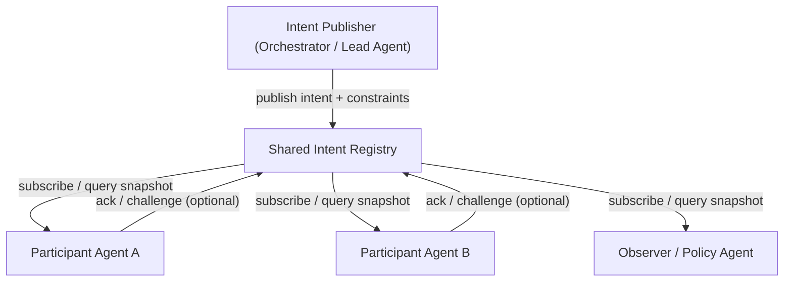

# Shared Intent Registry

## Agent Interaction Diagram

## Pattern

**References:**

- Outshift IoC L9 **SAB (Semantic Alignment Broadcast)**;
  [outshift-open/ioc-protocols-models](https://github.com/outshift-open/ioc-protocols-models).
- Antonio Gullí, *Agentic Design Patterns* (Springer, 2025), Ch. 11 - Goal Setting and Monitoring.
  [https://doi.org/10.1007/978-3-032-01402-3](https://doi.org/10.1007/978-3-032-01402-3)

**Category:** Internet of Cognition

A **shared intent registry** holds the **canonical statement of what the multi-agent system is trying to achieve**-
goal text, success criteria, **hard constraints**, and **versioned amendments**-so every agent queries the **same
intent snapshot** instead of inferring purpose from chat fragments.

Where alignment *negotiates* terms round-by-round (see Mediated Semantic Alignment), the registry **broadcasts** the
current authoritative intent to all subscribers. Agents **subscribe** to changes, **acknowledge** receipt, and optionally
**challenge** when local reasoning detects conflict-before acting on stale or divergent goals.

Typical ingredients:

- **Intent record** - goal, scope ids (order, shipment, incident), owner, version, effective time.
- **Constraint bundle** - price caps, policy flags, deadlines, forbidden actions (machine-readable where possible).
- **Publish / supersede** - only authorized publishers write; supersession keeps history for audit.
- **Subscription / snapshot query** - agents pull `intent://task-123@v4` before tool calls or hand-offs.
- **Acknowledgment trail** - optional record of which agents confirmed which version (feeds governance and replay).

This pattern is **not** the same as:

- **Mediated Semantic Alignment** - negotiates meaning between parties; the registry **publishes** what leadership
  already set (or what alignment produced as output).
- **Shared Agent Memory** - operational facts (`state: PAYMENT_COMPLETE`); intent is **purpose and constraints**, not
  transient task fields.
- **Shared Knowledge Store** - long-lived reference catalogs (yield history, partner profiles); intent is **per task or
  per run**, versioned and retirable.
- **Session Context Buffer** - ephemeral negotiation scratchpad; intent registry is **authoritative** until superseded.
- **Policy-Enforced Execution** - enforcement happens at action time; the registry is the **shared cognitive source**
  agents read when deciding *what* to optimize for.

The pattern transfers wherever **goal drift** is costly: fulfillment chains, regulated workflows, human-delegated
objectives, or any MAS where "what we are doing" must stay **one query away** for every agent.

---

## Use case

**Coffee Agntcy** is a coffee company set in a familiar supply chain: **upstream**, it depends on **farms in different
countries**, each with its own harvest rhythm, quality, and availability; **midstream**, it **buys and allocates** lots-
matching supply to commercial needs under real constraints; **downstream**, it must eventually **honor customer
promises** through operations, logistics, and finance it does not always own end to end. The company sits **between**
those worlds: much of the drama is ordinary commerce-contracts, risk, partners, and tools-rather than a single team
inside one building holding every fact.

---

## Scenario

Customer order: **5,000 lbs Tatooine arabica at $3.52/lb, deliver by March 15, organic certification required**. Five
agents touch the order; each message thread only shows a slice of the ask.

**Without shared intent registry**

- Farm agent optimizes for **volume**; shipper optimizes for **earliest port date**; finance applies **standard terms**
  without organic surcharge rules mentioned once in an early chat.
- A constraint change ("move delivery to March 10") lives in **one DM**; other agents never update their plan.
- Post-incident review cannot answer: **what goal version** was binding when the wrong lot shipped?

**With shared intent registry**

- Logistics buyer **publishes** `intent://order-8842@v1` with goal, price cap, certification flag, delivery window.
- Farm, shipper, finance **query snapshot** before each major action; subscribers receive **v2** when delivery moves to
  March 10.
- Event ledger and shared memory **cite intent version** on each retain; replay shows decisions against the correct goal.

---

## Workflow

**Intent Publisher** (typically the lead or supervisor agent) creates the first intent record when a task opens and
**supersedes** it when the user or policy changes the ask. Only this role (or a governance delegate) may publish.

**Shared Intent Registry** stores versioned records, serves snapshots, and notifies subscribers. In IoC deployments this
can align with L9 SAB broadcast semantics or CFN knowledge/memory APIs scoped to `intent` objects; other
implementations use a document store or graph node type.

**Participant agents** query or subscribe before planning steps; optional **ack** confirms they acted on `vN`.

**Observer / Policy Agent** may subscribe read-only to detect drift between intent and telemetry (feeds Observability
category, not replace it).

**Flow in one breath**

1. Publisher opens task → publishes intent v1 (goal + constraints).
2. Subscribers receive snapshot; agents begin work citing `intent://…@v1`.
3. Change arrives → publisher supersedes to v2 → broadcast update.
4. Shared memory / ledger entries reference intent version on each retain.
5. Task closes → intent record archived; registry entry retirable per policy.
