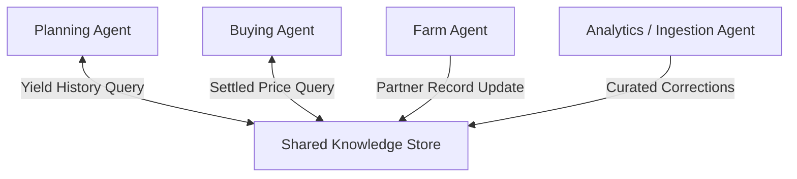

# Shared Knowledge Store

## Agent Interaction Diagram

## Pattern

A **shared knowledge store** **persists knowledge across tasks and time**—yield history, supplier reliability, settled
prices—so agents query **curated records** instead of re-scraping the world on every run. Long-lived facts live in one
governed place with keys, versions, and provenance.

**Catalog and semantics** host canonical objects; consumer workflows **cite record IDs**; controlled pipelines ingest
corrections with **audit trails**. The pattern is the difference between arguing from memory and arguing from records
the firm stands behind.

---

## Use case

**Coffee Agntcy** is a coffee company set in a familiar supply chain: **upstream**, it depends on **farms in different
countries**, each with its own harvest rhythm, quality, and availability; **midstream**, it **buys and allocates** lots—
matching supply to commercial needs under real constraints; **downstream**, it must eventually **honor customer
promises** through operations, logistics, and finance it does not always own end to end. The company sits **between**
those worlds: much of the drama is ordinary commerce—contracts, risk, partners, and tools—rather than a single team
inside one building holding every fact.

---

## Scenario

Planners lean on **multi-year yield, pricing, and partner behavior** when contracts get serious; the store is what keeps
those arguments grounded.

A **Workflow** section will describe how this pattern is realized once a concrete layout exists.
