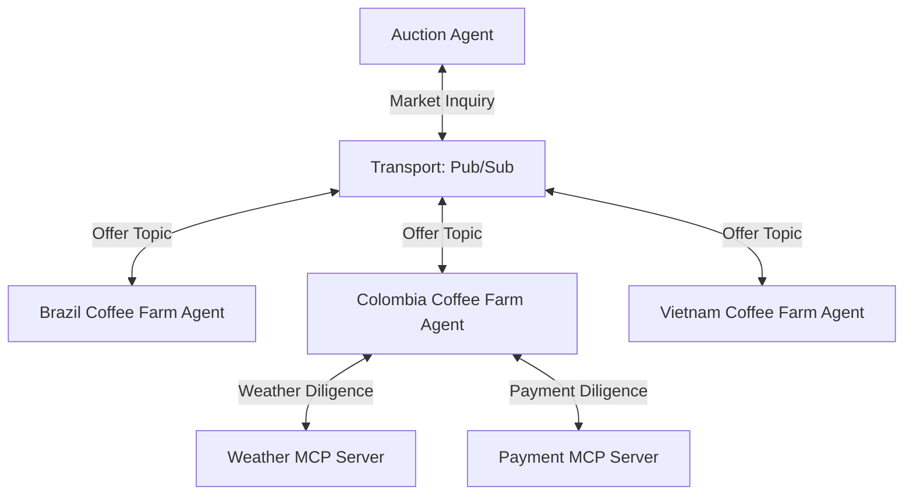

# Supervisor

## Agent Interaction Diagram

## Pattern

> **TODO** — full pattern-level write-up. This is a minimal stub so the pattern reference library has reachable
> reference material for the **Supervisor** pattern; a follow-up issue will replace this with the proper authored
> doc.
>
> **Status: API-only.** This doc is served via `POST /patterns/{name}/chat` for the implemented
> **Supervisor** pattern, but implemented patterns are not yet shown in the Reference Library sidebar
> (which currently lists only unimplemented placeholder patterns). Wiring implemented patterns into the
> Reference Library is tracked as a follow-up.

The **Supervisor** pattern places **one orchestrating agent** at the centre of a workflow and routes work out to a
small set of **clear callees**. The supervisor turns a vague ask into a structured plan, delegates per-step, collects
results, and produces a single coherent answer.

In CoffeeAGNTCY this pattern backs the **Publish Subscribe** and **Publish Subscribe Streaming** workflows under the
**Coffee Agntcy → Purchasing** scenario — the diagram above is from those implementations and is included here as
illustrative topology while the full pattern-level write-up is pending.

See the per-workflow reference docs for the concrete implementations:

- [Publish Subscribe](./publish_subscribe.md)
- [Publish Subscribe Streaming](./publish_subscribe_streaming.md)
