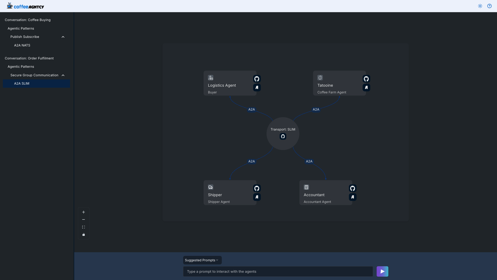

# Group Conversation

This document explains how to run the logistics multi-agent conversation locally (via Docker Compose or individual `make` targets) and how an order progresses through the system.

---

## 1. Services / Agents

| Role                | Python entrypoint                       | Purpose                                                         |
| ------------------- | --------------------------------------- | --------------------------------------------------------------- |
| Logistic Supervisor | `agents/supervisors/logistic/main.py`   | Starts the workflow, handles user input, emits `RECEIVED_ORDER` |
| Shipper Agent       | `agents/logistics/shipper/server.py`    | Progresses shipping states (`CUSTOMS_CLEARANCE`, `DELIVERED`)   |
| Accountant Agent    | `agents/logistics/accountant/server.py` | Confirms payment (`PAYMENT_COMPLETE`)                           |
| Tatooine Farm Agent | `agents/logistics/farm/server.py`       | Moves order to `HANDOVER_TO_SHIPPER` after `RECEIVED_ORDER`     |

---

## 2. Order Lifecycle

Sequence (agent → state produced):

1. Supervisor → `RECEIVED_ORDER`
2. Farm Agent → `HANDOVER_TO_SHIPPER`
3. Shipper Agent → `CUSTOMS_CLEARANCE`
4. Accountant Agent → `PAYMENT_COMPLETE`
5. Shipper Agent → `DELIVERED` (final)

### Transition Table

| From State            | To State              | Responsible Agent |
| --------------------- | --------------------- | ----------------- |
| (User Prompt)         | `RECEIVED_ORDER`      | Supervisor        |
| `RECEIVED_ORDER`      | `HANDOVER_TO_SHIPPER` | Farm Agent        |
| `HANDOVER_TO_SHIPPER` | `CUSTOMS_CLEARANCE`   | Shipper Agent     |
| `CUSTOMS_CLEARANCE`   | `PAYMENT_COMPLETE`    | Accountant Agent  |
| `PAYMENT_COMPLETE`    | `DELIVERED`           | Shipper Agent     |

### Flow (ASCII)

```
User Prompt
↓
[Supervisor] → RECEIVED_ORDER → [Farm]
[Farm] → HANDOVER_TO_SHIPPER → [Shipper]
[Shipper] → CUSTOMS_CLEARANCE → [Accountant]
[Accountant] → PAYMENT_COMPLETE → [Shipper]
[Shipper] → DELIVERED (final)
```

---

## Run With Docker Compose (includes SLIM transport)

**Step 1: Run the SLIM Message Bus Gateway and Observability stack**

To enable A2A Group communication over SLIM, you need to run the SLIM message bus gateway.

Additionally, run the observability stack that includes OTEL Collector, Grafana, and ClickHouse DB. You can do this by executing the following command:

```sh
docker-compose up slim clickhouse-server otel-collector grafana
```

**Step 2: Run the Group Conversation Stack**

If you want to run the group conversation stack separately, you can do so by running the following command:

```sh
docker-compose up logistic-farm logistic-supervisor logistic-shipper logistic-accountant
```

This will start the supervisor, shipper, accountant, farm, and SLIM transport services.

---

## Run Individually (one terminal per service)

Terminal 1:

```sh
# The LLM env vars (e.g. `OPENAI_API_KEY`) are required the logistic-supervisor.
make logistic-supervisor
```

Terminal 2:

```sh
make shipper
```

Terminal 3:

```sh
make accountant
```

Terminal 4:

```sh
make logistic-farm
```

## Testing the Group Conversation

To test the group conversation, you can execute the following command:

```sh
curl -X POST http://127.0.0.1:9090/agent/prompt \
  -H "Content-Type: application/json" \
  -d '{
    "prompt": "I want to order  5000 lbs of coffee for 3.52 $ from the Tatooine farm."
  }'
```

Expected output:

```json
{
  "response": "Order ORD-3A7F5B2C from Tatooine for 500 units at $3.50 has been successfully delivered."
}
```

## HelpDesk Agent (Updated 2025-10-15)

After all agents are running, you can stream the group chat events (server-sent events) to observe each state transition of an order.

Start the HelpDesk agent in a new terminal:
```sh
make helpdesk
```

Stream the chat log events (SSE):
```sh
curl -H "Accept: text/event-stream" "http://localhost:9094/agent/chat-logs"
```

You will see a sequence of `data:` lines, each a JSON object representing one state transition (fields: `order_id`, `sender`, `receiver`, `message`, `state`, `timestamp`):

```
data: {"order_id": "dbfd55776ce34f30bd75220ec70a5063", "sender": "Supervisor", "receiver": "Tatooine Farm", "message": "Create an order dbfd55776ce34f30bd75220ec70a5063 with price 3.5 and quantity 500.", "state": "RECEIVED_ORDER", "timestamp": "2025-10-15T21:31:30.230486+00:00"}

data: {"order_id": "dbfd55776ce34f30bd75220ec70a5063", "sender": "Tatooine Farm", "receiver": "Shipper", "message": "Order dbfd55776ce34f30bd75220ec70a5063 handed off for international transit. Prepared shipment and documentation.", "state": "HANDOVER_TO_SHIPPER", "timestamp": "2025-10-15T21:31:30.280761+00:00"}

data: {"order_id": "dbfd55776ce34f30bd75220ec70a5063", "sender": "Shipper", "receiver": "Accountant", "message": "Customs cleared for order dbfd55776ce34f30bd75220ec70a5063; documents forwarded for payment processing. Customs docs validated and cleared.", "state": "CUSTOMS_CLEARANCE", "timestamp": "2025-10-15T21:31:30.305481+00:00"}

data: {"order_id": "dbfd55776ce34f30bd75220ec70a5063", "sender": "Accountant", "receiver": "Shipper", "message": "Payment confirmed for order dbfd55776ce34f30bd75220ec70a5063; preparing final delivery. Payment verified and captured.", "state": "PAYMENT_COMPLETE", "timestamp": "2025-10-15T21:31:30.479570+00:00"}

data: {"order_id": "dbfd55776ce34f30bd75220ec70a5063", "sender": "Shipper", "receiver": "Supervisor", "message": "Order dbfd55776ce34f30bd75220ec70a5063 delivered successfully; closing shipment cycle. Final handoff completed.", "state": "DELIVERED", "timestamp": "2025-10-15T21:31:31.430532+00:00"}
```

## Group Communication UI



## Observability

Follow substeps 1-3 from **Step 6: Visualize OTEL Traces in Grafana** in the main [README](../README.md) to set up Grafana and import the **Group Conversation Dashboard** [`group_conversation_dashboard.json`](../group_conversation_dashboard.json) for monitoring the logistics multi-agent workflow traces.
