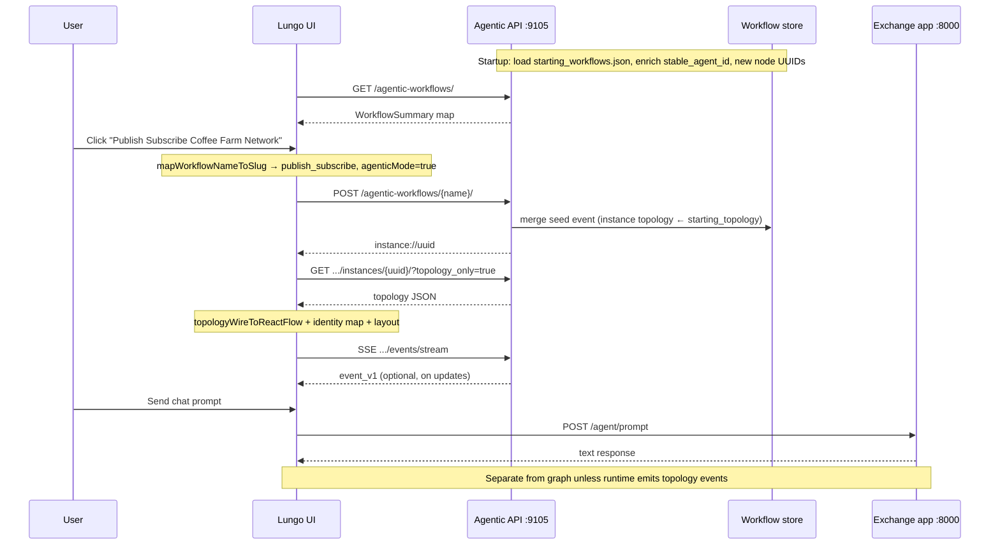

# Walkthrough: Publish Subscribe Coffee Farm Network

Step-by-step guide to how the Lungo UI loads and renders **Publish Subscribe Coffee Farm Network** using the Agentic Workflows API, including where static frontend maps ([#568](https://github.com/agntcy/coffeeAgntcy/issues/568), [#569](https://github.com/agntcy/coffeeAgntcy/issues/569)) fit in.

Same pipeline applies to other catalog workflows with different nodes and maps.

---

## Cast of characters (three backends)

The UI talks to **three different servers** for this demo:

| Service | Typical port | Role in this workflow |
|---------|--------------|------------------------|
| **Agentic Workflows API** | `9105` (`VITE_AGENTIC_WORKFLOWS_API_URL`) | Catalog, graph topology, SSE |
| **Exchange / auction app** | `8000` (`VITE_EXCHANGE_APP_API_URL`) | Chat: `POST /agent/prompt` for non-streaming publish/subscribe |
| **Identity / directory** (via auction app URL) | same `8000` base | Badge/policy and OASF card fetches when you click nodes |

The graph is **not** drawn from chat responses. Chat and graph are linked only because both use the same **UI pattern** (`publish_subscribe`), selected via the hardcoded name map ([#568](https://github.com/agntcy/coffeeAgntcy/issues/568)).

---

## Phase 0 — Source of truth on disk (before any HTTP)

### Step 0.1 — Workflow definition in JSON

In `api/agentic_workflows/starting_workflows.json`, the workflow is defined as:

- **`name`**: canonical workflow id (URL path segment, map key, event payloads).
- **`pattern`**: catalog grouping label (`"Supervisor-worker"`) — **not** the UI’s `publish_subscribe` slug.
- **`use_case` / `scenario`**: sidebar grouping only.
- **`starting_topology`**: 7 nodes, 6 edges (see diagram below).

### Step 0.2 — Graph shape (logical, not pixel positions)

```text
Layer 0          Layer 1           Layer 2                    Layer 3
────────         ───────           ───────                    ───────

[Auction Agent]──►[Transport]──►[Brazil Farm]
                      │          [Colombia Farm]──branch──►[Weather MCP]
                      │          [Vietnam Farm]            [Payment MCP]
                      └──────────► (same transport to each farm)
```

- **Auction Agent** → **Transport** → each farm (custom edges).
- **Colombia** → **Weather** and **Payment** (branching edges).

Positions are **not** in JSON. Only `layer_index` (0–3). The frontend computes x/y from layers (`frontend/src/utils/topologyLayout.ts`).

### Step 0.3 — What each node carries in JSON

**Agent node** (example: Brazil):

- `type`: `customNode`
- `label`: e.g. `"Brazil Coffee Farm Agent"`
- `layer_index`: e.g. `2`
- `agent_record_uri`: path or URL to OASF JSON

**Transport node**:

- `type`: `transportNode`
- `label`: `"Transport"`
- No `agent_record_uri`

**Important:** **`label` in topology ≠ `name` in OASF JSON.**

| Topology `label` | OASF file `name` field |
|------------------|-------------------------|
| `"Auction Agent"` | `"Auction Supervisor agent"` |
| `"Brazil Coffee Farm Agent"` | `"Brazil Coffee Farm"` |

Stable agent id is derived from **OASF `name`**, not from topology `label`.

---

## Phase 1 — Server startup: load catalog and enrich agents

When the Agentic Workflows API process starts, it reads and transforms `starting_workflows.json` (`api/agentic_workflows/workflows.py`).

### Step 1.1 — Validate JSON → Pydantic `Workflow` models

Each array entry becomes a `Workflow` with `starting_topology`, etc.

### Step 1.2 — For each agent node, load OASF and assign `stable_agent_id`

For Brazil’s `agent_record_uri`, the server:

1. Resolves the path relative to `api/agentic_workflows/` → reads `brazil-coffee-farm.json`.
2. Reads `"name": "Brazil Coffee Farm"`.
3. Computes `uuid5(namespace, "Brazil Coffee Farm")` with namespace `uuid5(NAMESPACE_DNS, "agent.workflow.lungo.coffeeAGNTCY.com")`.
4. Sets `stable_agent_id: "agent://ea3ce2b8-68b6-5fc9-9fa4-491cb71b7bf4"` (verified in frontend tests).

If the file is missing or invalid, the node is kept but **`stable_agent_id` may be absent** — then the frontend identity map cannot key off UUID ([#569](https://github.com/agntcy/coffeeAgntcy/issues/569)).

### Step 1.3 — Replace placeholder node/edge IDs with fresh runtime IDs

Placeholder ids like `node://1a000001-...` in the file are **not** what clients see:

- Each node gets a **new** `node://<random-uuid4>`.
- Edges are rewired by matching **labels** (e.g. edge that pointed at “Brazil Coffee Farm Agent” now points at the new Brazil node id).
- Edge ids are also regenerated.

So: **topology shape is stable; node ids change every server reload** (and per instance, see Phase 4).

### Step 1.4 — In-memory catalog

`get_workflows()` returns a dict keyed by workflow name. That is what list/instantiate handlers use.

---

## Phase 2 — Browser loads: catalog only (no graph yet)

### Step 2.1 — React app mounts (`RootPage` → `useApp`)

Default UI pattern in code is **`group_communication`**, not publish/subscribe. Until you pick this workflow (or something maps to `publish_subscribe`), the main area may still be on another pattern’s static fallback graph.

### Step 2.2 — `useEffect` fetches catalog

**HTTP:** `GET http://127.0.0.1:9105/agentic-workflows/`

Implemented in `frontend/src/utils/agenticWorkflowsApi.ts` → `fetchWorkflowSummariesWithRetry`.

**Response shape (conceptually):**

```json
{
  "Publish Subscribe Coffee Farm Network": {
    "name": "Publish Subscribe Coffee Farm Network",
    "pattern": "Supervisor-worker",
    "use_case": "Coffee Agntcy",
    "scenario": "Coffee Buying"
  }
}
```

The client flattens this object into `WorkflowSummary[]`.

### Step 2.3 — Auto-pick a workflow for current pattern

When catalog + `selectedPattern` change, if nothing valid is selected, `pickDefaultWorkflowSummaryForPattern` finds summaries where `mapWorkflowNameToSlug(summary.name) === pattern`.

For `publish_subscribe`, that only matches **exactly**:

`"Publish Subscribe Coffee Farm Network"` → `WORKFLOW_NAME_TO_PATTERN_SLUG` ([#568](https://github.com/agntcy/coffeeAgntcy/issues/568)).

### Step 2.4 — Sidebar tree (dynamic, no hardcoded tree)

`groupWorkflowsByPatternUseCaseAndScenario` (`frontend/src/utils/sidebarHierarchy.ts`) builds:

```text
Supervisor-worker                          ← from API `pattern` field
  └─ Coffee Agntcy: Coffee Buying          ← use_case + scenario
       ├─ Publish Subscribe Coffee Farm Network   ← clickable
       └─ Publish Subscribe Streaming Coffee ...  ← different workflow
```

Leaves are **disabled** (grey, no click) when `mapWorkflowNameToSlug(name) === null` (`CatalogTree.tsx`).

---

## Phase 3 — You select the workflow

### Step 3.1 — Click leaf in `CatalogTree`

`onSelectWorkflow(summary)` → `selectWorkflowFromCatalog` in `useApp.ts`:

1. `slug = mapWorkflowNameToSlug("Publish Subscribe Coffee Farm Network")` → `"publish_subscribe"`.
2. If `slug === null`, return (no-op).
3. Reset chat/streaming state.
4. `setSelectedPattern("publish_subscribe")`.
5. `setSelectedWorkflowSummary(summary)`.
6. `setLiveGraphConfig(null)`.

**Pattern slug is now the “mode”** for chat URL, streaming flags, and graph behavior.

### Step 3.2 — `MainArea` receives props

`pattern={selectedPattern}` and `selectedWorkflowSummary={selectedWorkflowSummary}`.

Inside `useMainArea.ts`:

- `config = getGraphConfig("publish_subscribe")` — **legacy static graph** used as initial React Flow state and fallback.
- `useNodesState(config.nodes)` / `useEdgesState(config.edges)` — graph state starts as **static** nodes/edges from `graphConfigsData.tsx`.

That static snapshot is overwritten moments later if agentic mode turns on.

---

## Phase 4 — Agentic mode gate

`useWorkflowGraphFromAgenticApi` computes:

```ts
agenticMode = Boolean(
  selectedWorkflowSummary &&
  workflowName &&
  mapWorkflowNameToSlug(workflowName) === pattern,
)
```

For this workflow: `"Publish Subscribe Coffee Farm Network"` → `publish_subscribe` === `pattern` → **`agenticMode === true`**.

Effects:

- `skipStaticGraphSync: true` in `useMainAreaGraphEffects` — **stops** pushing `getGraphConfig()` nodes/edges on pattern changes.
- Hook `useEffect` runs bootstrap (instantiate + topology + SSE).

If the name map were wrong, you would **stay on the old hardcoded graph** with hand-tuned positions and farm icons ([#568](https://github.com/agntcy/coffeeAgntcy/issues/568)).

---

## Phase 5 — Instantiate workflow instance (graph session)

### Step 5.1 — `POST` instantiate

**HTTP:**  
`POST http://127.0.0.1:9105/agentic-workflows/Publish%20Subscribe%20Coffee%20Farm%20Network/`

**Server** (`api/agentic_workflows/router.py`):

1. Looks up workflow by name.
2. Generates `uuid4` → `instance://<uuid>`.
3. Builds seed `event_v1` via `build_instantiate_seed_event` (`instance_lifecycle.py`):
   - Copies workflow metadata + full `starting_topology` (with enriched `stable_agent_id`, new node ids).
   - Registers new instance with **`topology: {}`** (empty).
4. `store.submit_event` + `wait_merge_idle`.
5. Returns `{ "workflow_instance_id": "instance://..." }`.

### Step 5.2 — Merge: empty instance topology ← copy `starting_topology`

In `common/workflow_instance_store/merge.py`, when instance topology has no nodes/edges yet, **`starting_topology` is copied** as the base, then the empty delta is applied. Result: instance topology equals the workflow’s starting graph (7 nodes, 6 edges) with runtime ids.

The UI reads **instance** topology, not definition-only.

### Step 5.3 — `GET` instance topology

**HTTP:**  
`GET .../agentic-workflows/Publish%20Subscribe%20Coffee%20Farm%20Network/instances/<uuid>/?topology_only=true`

Path uuid is parsed from `instance://` prefix (`instanceIdToPathUuid` in `agenticWorkflowsClient.ts`).

### Step 5.4 — SSE subscription

**URL:**  
`GET .../instances/<uuid>/events/stream`

On any event that touches this instance, the hook **debounces** (~80ms) and refetches topology. That matters when auction/logistics code emits `event_v1` topology updates during a run; for a quiet catalog-only load, you may only see the initial graph.

---

## Phase 6 — Wire topology → React Flow (per node)

`applyInstanceTopology` → `topologyWireToReactFlow(topology, { identityUiVariant: "publish_subscribe" })`.

### Step 6.1 — Layout

`layoutPositionsByLayer`:

- Layer 2: Brazil, Colombia, Vietnam → three x positions, shared y.
- Layer 0: Auction centered above; layer 1: Transport; layer 3: Weather + Payment.

Replaces static `position: { x, y }` from `graphConfigsData.tsx`.

### Step 6.2 — Transport node

- `type === "transportNode"` → React Flow type `transportNode`.
- `data.label = "Transport"`.
- `githubLink` from `resolveGithubFromAgentRecordUri` — usually **none** (no `agent_record_uri`).

### Step 6.3 — Brazil custom node — first pass

From wire:

- `label` → `splitTopologyNodeLabel` → `label1: "Brazil"`, `label2: "Coffee Farm Agent"`.
- Default icon: generic `SmartToy` MUI icon (not coffee bean image from static graph).
- `verificationStatus: "verified"` (default).
- `githubLink`: from relative `agent_record_uri` → browse URL under `urlsConfig.github.baseUrl`.

### Step 6.4 — `mergeAgenticTopologyIdentityUi` (static map [#569](https://github.com/agntcy/coffeeAgntcy/issues/569))

1. Read `stable_agent_id` from wire → UUID `ea3ce2b8-...`.
2. Lookup `IDENTITY_UI_BY_STABLE_AGENT_UUID[uuid]` in `agenticTopologyIdentityUiMap.ts` (row keyed by OASF `name` `"Brazil Coffee Farm"`).
3. Merge: `directoryAgentSlug`, `verificationStatus: "failed"`, `agentDirectoryLink`, badge/policy flags, GitHub URLs.

**Net:** API gave label + record path + stable id; UI map supplied verification color, directory slug, badge/policy availability.

### Step 6.5 — `enrichAgenticTopologyWellKnownUi`

Label heuristics for nodes **without** a map row (e.g. pure “Transport”). Brazil already has a map row.

### Step 6.6 — Attach click handlers

`attachHandlers` adds `onOpenIdentityModal` / `onOpenOasfModal` on each node’s `data`.

### Step 6.7 — Edges

- `type === "branching"` → branching edge component.
- Edge `data.label`: if type string contains `"mcp"` → MCP label, else A2A (heuristic).

### Step 6.8 — Commit to React Flow

`setNodes` / `setEdges` replace graph state. `onTopologyApplied` → `fitView` after 200ms.

---

## Phase 7 — What you see vs static graph

| Concern | Static `graphConfigsData` | Agentic path (this workflow) |
|--------|---------------------------|------------------------------|
| Node positions | Fixed pixels | From `layer_index` |
| Node ids | Constants like `NODE_IDS.BRAZIL_FARM` | Random `node://uuid` per instance |
| Icons | Coffee bean images, supervisor PNG | Generic MUI icons |
| GitHub / directory | In node `data` | URI resolve + identity map |
| Verification badge | In node `data` | Map override (Brazil = failed) |
| Edge handles | `sourceHandle` / `targetHandle` ids | Defaults from `HANDLE_TYPES.ALL` |

---

## Phase 8 — Interactions on the graph

### Identity modal

`CustomNode` → `IdentityApi` uses `identityAppsSlug` from map → e.g.  
`GET http://127.0.0.1:8000/identity-apps/{slug}/badge`

### OASF / directory modal

Uses `directoryAgentSlug` from map →  
`GET http://127.0.0.1:8000/agents/{slug}/oasf` (`DirectoryApi.ts`).

Fallback: `getOasfSlugFromNodeData` label guessing if slugs missing ([#569](https://github.com/agntcy/coffeeAgntcy/issues/569)).

### GitHub link on node

Renders if `data.githubLink` passes `SecurityClass.isSafeExternalUrl`.

---

## Phase 9 — Chat (same pattern, different server)

Non-streaming publish/subscribe prompt:

**HTTP:** `POST http://127.0.0.1:8000/agent/prompt` (`useAgentAPI` / `useApp.handleDropdownSelect`)

Hits the **auction supervisor** exchange app, not port 9105. Does not use `instantiateWorkflow`.

Auction code *can* accept `workflow_instance_id` and emit topology `event_v1` updates → SSE → graph refetch; the UI bootstrap does not obviously pass the agentic `instanceId` into `sendMessage` today, so **chat and graph instance may be decoupled**.

Graph pulse animation from static `animationSequence` is **skipped when `agenticMode`** (`useMainArea.ts`).

---

## Phase 10 — Lifecycle / teardown

- Switch workflow/pattern → SSE closed, new `POST` instantiate → new instance id → new node ids → full bootstrap again.
- Workflow not in `WORKFLOW_NAME_TO_PATTERN_SLUG` → `agenticMode` false → static `getGraphConfig(pattern)`; sidebar leaf may be greyed out.

---

## End-to-end sequence



---

## Where issues #568 and #569 sit

| Step | #568 (workflow name → pattern) | #569 (agent UI map) |
|------|--------------------------------|---------------------|
| Sidebar click / agentic gate | Required | — |
| Catalog fetch | Not needed if API exposed `lungo_pattern_slug` | — |
| Topology → pixels | — | Not needed if API sent slugs, links, badges, icons |
| Modals / GitHub | — | Required today |

---

## Subtle gotchas

1. **Three names for “pattern”**: API `"Supervisor-worker"`, UI `"publish_subscribe"`, display “Publish/Subscribe”.
2. **Label vs OASF name**: topology label is for humans/edge remap; `stable_agent_id` keys off OASF `name`.
3. **Ids change**: file placeholders → server load UUIDs → new instance UUIDs; only `stable_agent_id` is stable across runs.
4. **Colombia’s `agent_record_uri` can be absolute GitHub raw URL**; others are relative.
5. **Default app pattern is group communication** — select this workflow to run this path.
6. **Static graph still loads first** then gets replaced; brief flash possible.
7. **Chat ≠ graph API** — same demo, two HTTP stacks.

---

## Key source files

| Area | Path |
|------|------|
| Workflow catalog (disk) | `api/agentic_workflows/starting_workflows.json` |
| Catalog load / enrich | `api/agentic_workflows/workflows.py` |
| HTTP routes | `api/agentic_workflows/router.py` |
| Instantiate seed | `api/agentic_workflows/instance_lifecycle.py` |
| Event merge / topology copy | `common/workflow_instance_store/merge.py` |
| Name → pattern map (#568) | `frontend/src/utils/agenticWorkflowsApi.ts` |
| Identity UI map (#569) | `frontend/src/utils/agenticTopologyIdentityUiMap.ts` |
| Topology → React Flow | `frontend/src/utils/topologyToReactFlow.tsx` |
| Graph session hook | `frontend/src/hooks/useWorkflowGraphFromAgenticApi.ts` |
| App / catalog selection | `frontend/src/useApp.ts` |
| Legacy static graph | `frontend/src/utils/graphConfigsData.tsx` |

**Related PR:** [#551](https://github.com/agntcy/coffeeAgntcy/pull/551) — introduced dynamic catalog graphs and temporary frontend maps.
