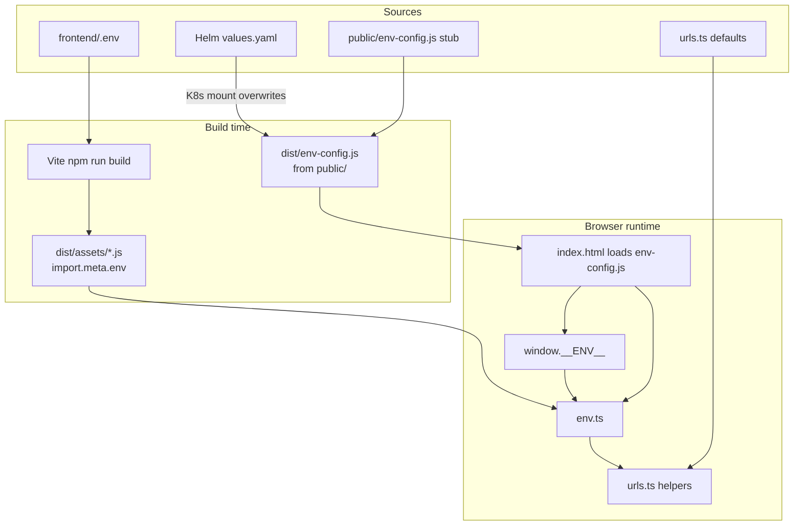

# Lungo frontend — environment configuration

How `VITE_*` values are produced, loaded, and read in local dev, Docker, and Kubernetes.

## Resolution order (runtime in the browser)

Every config lookup goes through `src/utils/env.ts`, then usually `src/urls.ts`:

```text
1. window.__ENV__[key]     ← set by /env-config.js (runtime)
2. import.meta.env[key]    ← baked by Vite at npm run build / dev
3. LUNGO_FRONTEND_URLS.apiBaseDefaults in urls.ts  ← hardcoded localhost fallbacks
```

`env.ts` implements steps 1–2:

```ts
runtimeEnv(key) ?? import.meta.env[key]
```

`urls.ts` adds step 3 for URL helpers, e.g. `getGrafanaUrl()`:

```ts
env.get("VITE_GRAFANA_URL") ?? apiBaseDefaults.grafana
```

App code should use `@/urls` helpers (or `env.get`) — not `import.meta.env` directly.

---

## Files and roles

| File / artifact | Role |
|-----------------|------|
| `frontend/.env` | Developer-local values (gitignored). Used by Vite in dev and at **image build** time. |
| `frontend/.env.example` | Committed template; documents all `VITE_*` keys. |
| `frontend/public/env-config.js` | Static stub copied to `dist/env-config.js` on build. Sets `window.__ENV__ = {}` until overridden. |
| `frontend/index.html` | Loads `/env-config.js` **before** the React bundle so `window.__ENV__` exists early. |
| `deployment/helm/ui/values.yaml` → `configs.env.data` | Kubernetes runtime source for `env-config.js`. |
| Helm templates | Generate ConfigMap + mount over `/app/dist/env-config.js` in the UI pod. |

---

## Timeline: `npm run dev` (local Vite)

```text
T0  Developer maintains frontend/.env (from .env.example)

T1  npm run dev
    └─ Vite loads frontend/.env → import.meta.env.VITE_* available to bundled code

T2  Browser requests index.html
    └─ <script src="/env-config.js"> runs first
    └─ Vite serves public/env-config.js → window.__ENV__ = {}

T3  Browser loads /src/main.tsx (React app)

T4  App calls getGrafanaUrl() etc.
    └─ env.get("VITE_GRAFANA_URL")
         ├─ window.__ENV__ empty → skip
         ├─ import.meta.env.VITE_GRAFANA_URL from .env → used
         └─ (if missing) urls.ts localhost default
```

**Effective source in dev:** `frontend/.env` via `import.meta.env`, because `public/env-config.js` is an empty stub.

---

## Timeline: Docker image build + `docker compose` UI

```text
T0  frontend/.env present on build host (copied into image context)

T1  docker build (Dockerfile.ui)
    └─ COPY frontend/ → includes .env, public/env-config.js, index.html
    └─ npm run build
         ├─ Vite bakes .env into dist/assets/*.js (import.meta.env)
         └─ Copies public/env-config.js → dist/env-config.js (empty stub)

T2  Container starts: npx serve -s dist -l 3000
    └─ docker-compose may set env_file: frontend/.env on the container
    └─ Static serve does NOT regenerate env-config.js from container env

T3  Browser loads app (same as production static serve)
    └─ /env-config.js → dist/env-config.js (empty stub unless replaced)
    └─ Config from import.meta.env (build-time .env) + urls.ts defaults
```

**Effective source in Docker (without Helm):** values from `frontend/.env` at **build** time. Rebuild the image to change API URLs.

---

## Timeline: Kubernetes / Helm (runtime override)

```text
T0  helm install/upgrade with values.yaml (configs.env.data)

T1  Helm renders ConfigMap lungo-ui-env-configmap
    └─ templates/configmap.tpl.yaml
    └─ templates/_helpers.tpl → lungo-ui.envConfigJs
    └─ Key env-config.js contains:
         window.__ENV__ = {"VITE_GRAFANA_URL":"...", ...};

T2  Pod starts with UI image (dist/ from generic build)

T3  Volume mount (deployment.tpl.yaml)
    └─ ConfigMap key env-config.js → /app/dist/env-config.js
    └─ Overwrites the empty stub from the image

T4  Browser requests index.html
    └─ <script src="/env-config.js"> loads mounted file
    └─ window.__ENV__ populated from Helm values

T5  App calls env.get("VITE_*")
    └─ window.__ENV__ wins over import.meta.env
```

**Effective source in K8s:** `values.yaml` → `configs.env.data` (runtime), as long as `index.html` includes the `env-config.js` script tag.

Preview rendered ConfigMap:

```bash
helm template lungo-ui deployment/helm/ui \
  --show-only templates/configmap.tpl.yaml
```

---

## Timeline: Vitest

```text
T0  src/test/setup.ts runs before tests
    └─ window.__ENV__ = {}

T1  Tests call env.get / urls helpers
    └─ Same resolution as browser; import.meta.env from Vite test config if set
```

---

## Helm generation detail

**Input:** `deployment/helm/ui/values.yaml`

```yaml
configs:
  env:
    data:
      VITE_GRAFANA_URL: http://127.0.0.1:3001
      # ...
```

**Merge helper** (`templates/_helpers.tpl`):

- `lungo-ui.mergedRuntimeEnv` — builds a JSON object from `configs.env.data`
- `lungo-ui.envConfigJs` — emits `window.__ENV__ = <json>;`

**Output:** ConfigMap `lungo-ui-env-configmap`, data key `env-config.js`

**Mount:** `deployment.tpl.yaml` → `/app/dist/env-config.js` in the UI container

---

## `VITE_*` keys (shared contract)

Defined in `frontend/.env.example` and mirrored in Helm `values.yaml`:

| Key | Purpose |
|-----|---------|
| `VITE_EXCHANGE_APP_API_URL` | Coffee / auction API |
| `VITE_LOGISTICS_APP_API_URL` | Group messaging / logistics API |
| `VITE_DISCOVERY_APP_API_URL` | A2A / discovery API |
| `VITE_AGENTIC_WORKFLOWS_API_URL` | Workflow catalog & graph API |
| `VITE_AGENTIC_WORKFLOWS_API_KEY` | Workflows API auth |
| `VITE_GRAFANA_URL` | Grafana dashboard links |
| `VITE_DIRECTORY_SERVER_URL` | Agent directory |
| `VITE_DIRECTORY_VERSION` | Directory API version |
| `VITE_AGENTIC_WORKFLOWS_DOCS_GITHUB_BRANCH` | Workflow docs links |

TypeScript declarations: `src/vite-env.d.ts`.

---

## Design summary



- **Local dev:** `.env` → `import.meta.env` (primary); empty `env-config.js` is harmless.
- **Docker (no Helm):** same as build-time `.env` in the image.
- **Kubernetes:** Helm → `env-config.js` → `window.__ENV__` (primary); image build values are fallback only.

Keep `.env.example` and Helm `configs.env.data` in sync when adding or renaming keys.
