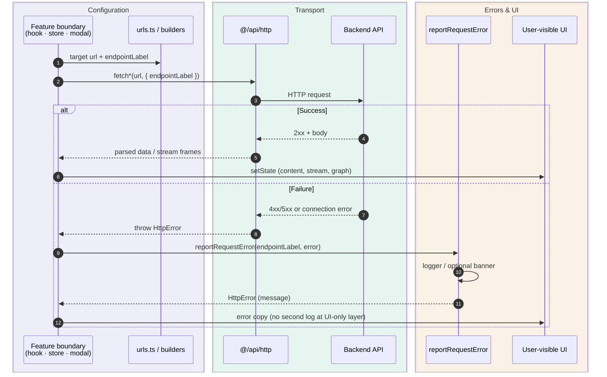
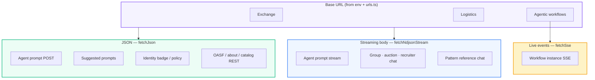
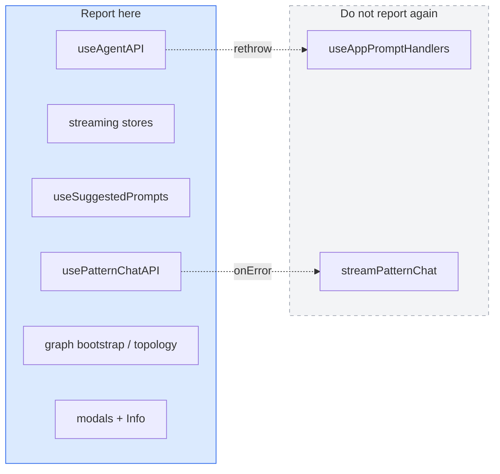

# Lungo frontend — HTTP requests and error handling

How the app builds URLs, performs network calls, logs failures, and shows errors to users. Complements [env-configuration.md](./env-configuration.md) (where base URLs come from).

## Summary

1. **Configuration** — `urls.ts` defines relative `apiPaths`, base URL helpers, and `HttpRequestTarget` (`url` + `endpointLabel`). Catalog chat routing uses `workflowChatRouting.ts` + `WorkflowSummary.chat_api_target`; other surfaces use builders in `httpRequestTargets.ts` or `agenticWorkflowsClient`.
2. **Transport** — All browser HTTP goes through `httpFetch` → specialized helpers (`fetchJson`, `fetchNdjsonStream`, `fetchSse`). Failures become **`HttpError`** with optional `status` and **`endpointLabel`** (for logs and metadata).
3. **Reporting** — Feature boundaries call **`reportRequestError`**: log (dev `logger` / prod redacted `unsafeLogger`), optionally push a global banner via **`userMessage`**. React render failures use **`reportUiError`** / **`ErrorBoundary`**.
4. **Presentation** — Each feature maps the returned `HttpError.message` (or helpers like `ndjsonStreamUserMessage`) into local UI: chat bubbles, modal `LoadingErrorState`, suggested-prompts `unavailableMessage`, graph `setAgenticError`, zustand store `error`, etc. The browser DevTools network console still logs failed `fetch` independently.

---

## URL and request targets

| Layer | Role |
|--------|------|
| `urls.ts` | Single source for paths, `joinBaseUrl`, `joinHttpRequest`, `LUNGO_FRONTEND_URLS.apiPaths`, exchange / logistics / discovery / agentic-workflows bases |
| `HttpRequestTarget` | `{ url, endpointLabel }` passed into fetch options and stored on streaming stores |
| `workflowChatRouting.ts` | **Catalog chat**: agent prompt, prompt stream, suggested prompts from `WorkflowSummary` (`chat_api_target`, `supports_streaming`) |
| `httpRequestTargets.ts` | **Legacy / fixed-base** builders (about, identity badge/policy, OASF, pattern-based transport, agentic pattern chat, documentation paths) |
| `agenticWorkflowsClient.ts` | Instantiate instance, topology, delete, **SSE subscribe** on agentic-workflows API base |

`endpointLabel` is usually the relative path (e.g. `/agent/prompt`, `/identity-apps/{slug}/badge`). Composite flows use **logical labels** documented in `urls.ts` (e.g. `agentic-workflows/bootstrap`, `agentic-workflows/sse`) when no single `apiPath` describes the operation.

---

## HTTP transport types

| Helper | Method / shape | Typical use |
|--------|----------------|-------------|
| **`httpFetch`** | Raw `fetch` + timeout + non-OK → `HttpError` | Base for all helpers |
| **`fetchJson`** | JSON request/response | Agent prompt (non-stream), suggested prompts, identity/directory modals, about, catalog REST |
| **`fetchNdjsonStream`** | POST + read NDJSON body (`lines` or `json-objects`) | Agent prompt stream, group/auction/recruiter streaming stores, pattern reference chat |
| **`fetchSse`** | EventSource-style SSE over fetch | Used inside agentic workflow instance subscription (bootstrap + topology sync) |

On failure, helpers attach **`endpointLabel`** to `HttpError` (from options, defaulting to URL). **`parseHttpError`** normalizes network errors, timeouts, aborts, and HTTP status bodies into stable user-facing messages.

---

## `reportRequestError`

Single call shape (see `src/errors/request/reportRequestError.ts`):

```ts
reportRequestError(endpointLabel: string, error: unknown, context?)
```

**`endpointLabel`** must come from the same source as the fetch:

- **`HttpRequestTarget.endpointLabel`** from `@/urls` builders (`buildIdentityBadgeRequest`, `getAgentPromptRequestForWorkflow`, …), or
- A **logical label** documented above `apiPaths` in `urls.ts` when no single route applies (bootstrap, SSE exhaustion, teardown).

Log title and notification `source` prefer **`HttpError.endpointLabel`** from the transport layer when set, otherwise the passed label.

Optional **`context.userMessage`** also triggers **`reportUiError`** → global notification banner (`errorNotificationStore`).

Returns **`HttpError`** for local state (`setError`, `unavailableMessage`, `setAgenticError`, etc.).

Graph modals call `fetch*` without a request argument; on failure they use the matching `*Request(...).endpointLabel` for `reportRequestError` (same builders as the fetch, rebuilt on the error path only).

---

## Where errors are caught and shown

| Area | Request owner | Report | User presentation |
|------|---------------|--------|-------------------|
| Main chat (non-stream) | `useAgentAPI` → `fetchJson` | `reportRequestError(promptRequest.endpointLabel, …)` then rethrow | `useAppPromptHandlers` → chat message / loading flags (no duplicate log) |
| Main chat (NDJSON stream) | `groupStreamingStore` / `auctionStreamingStore` / `recruiterStreamingStore` | `reportRequestError(streamRequest.endpointLabel, …)` in store `catch` | Store `error` + `ndjsonStreamUserMessage`; chat UI reads store |
| Suggested prompts menu | `useSuggestedPrompts` → `fetchJson` | `reportRequestError(endpointLabel, …)` on exhaustion | `unavailableMessage` + `SuggestedPromptsDropdown` |
| Pattern doc + pattern chat | `useAppPatternReference` / `usePatternChatAPI` | Explicit label from `buildAgenticWorkflowsDocumentationRequest` / pattern chat request | Pattern canvas error state; pattern chat callbacks |
| Workflow catalog | `useAppWorkflowCatalog` | Explicit catalog label | Catalog empty / error UI |
| Agentic graph bootstrap | `useWorkflowGraphAgenticBootstrap` | `agentic-workflows/bootstrap`, `agentic-workflows/sse` + optional `userMessage` | `setAgenticError` on graph |
| Topology refetch | `useWorkflowGraphTopologySync` | `agentic-workflows/refetch-topology` + `userMessage` | Graph stale / error messaging |
| Instance teardown | `useWorkflowGraphFromAgenticApi` | Logical delete / invalid-id labels | Session cleanup |
| Identity / OASF modals | `IdentityApi` / `DirectoryApi` → `fetchJson` | `reportRequestError(*Request(...).endpointLabel, …)` in modal `catch` | Modal `LoadingErrorState` |
| About (Info modal) | inline `fetchJson` | `reportRequestError(request.endpointLabel, …)` | Modal error text |
| React tree | `ErrorBoundary` | `reportUiError` | Full-page / inline fallback |

---

## Request pipeline — success and failure

Every networked feature follows the same five beats. The transport layer always tags failures; the **feature boundary** (hook, store, modal) owns logging and UI.

| Step | Layer | What happens |
|:--:|--------|----------------|
| **1** | **`@/urls`** | Pick base + `apiPaths` → `HttpRequestTarget` `{ url, endpointLabel }` (catalog via `workflowChatRouting`, else builders in `httpRequestTargets` / `*Request` helpers). |
| **2** | **`@/api/http`** | `fetchJson` · `fetchNdjsonStream` · `fetchSse` → `httpFetch` → browser `fetch`. |
| **3** | **On failure** | Non-OK / timeout / abort → **`HttpError`** with `status` + **`endpointLabel`** (from fetch options). |
| **4** | **`reportRequestError`** | Feature `catch` → log (`API Error - …`) → optional global banner if `userMessage`. |
| **5** | **Presentation** | `HttpError.message`, `ndjsonStreamUserMessage`, modal `LoadingErrorState`, chat bubble, graph `agenticError`, etc. |

> **DevTools vs app logs:** the browser always prints failed `GET`/`POST` lines in the network panel. That is separate from **`reportRequestError`**, which is the structured app log users/operators rely on.

### Sequence (one request, two outcomes)



### Transport lanes (what rides on step 2)



### Where to report (never twice)



**Rule:** whoever calls **`fetch*`** with the **`endpointLabel`** calls **`reportRequestError`**. Thin UI wrappers only map errors to copy.

---

## Conventions for new code

1. Build **`HttpRequestTarget`** (or use catalog helpers) in one place; pass **`url`** and **`endpointLabel`** into fetch options together.
2. Call **`reportRequestError`** at the **feature boundary** that owns the user-visible outcome (hook, store, modal), not inside low-level parsers.
3. Call **`reportRequestError(request.endpointLabel, error)`** at the feature boundary; use the matching `*Request(...)` helper from the same API module as the fetch when reporting modal failures.
4. Use a **logical `endpointLabel`** only for multi-step or non-fetch failures (bootstrap, SSE reconnect exhaustion).
5. Map to UI with **`HttpError.message`** or shared helpers (`ndjsonStreamUserMessage`); use **`userMessage`** in `reportRequestError` when the graph or shell should show a global banner.
6. Do not rely on the browser console alone — DevTools always logs failed network requests; app logging goes through **`reportRequestError`**.

---

## Key files

| Path | Purpose |
|------|---------|
| `src/urls.ts` | Paths, bases, `joinHttpRequest`, logical label docs |
| `src/httpRequestTargets.ts` | Non-catalog request builders |
| `src/utils/workflowChatRouting.ts` | Catalog chat targets |
| `src/api/http/` | `httpFetch`, `fetchJson`, `fetchNdjsonStream`, `fetchSse`, `parseHttpError` |
| `src/errors/request/reportRequestError.ts` | Request failure logging |
| `src/errors/ui/reportUiError.ts` | Non-request / banner notifications |
| `src/hooks/agent/useAgentAPI.ts` | Non-stream chat POST |
| `src/stores/*StreamingStore.ts` | NDJSON chat streams |
| `src/hooks/workflowGraph/useWorkflowGraphAgenticBootstrap.ts` | Bootstrap + SSE |
