# Agent Recruiter

Discover, evaluate, and dynamically recruit agents for on-demand task execution.

## Table of Contents

- [Overview](#overview)
- [Getting Started](#getting-started)
  - [Prerequisites](#prerequisites)
  - [Installation](#installation)
  - [LLM Configuration](#llm-configuration)
  - [Agent Directory Service](#agent-directory-service)
  - [A2A Server](#a2a-server)
- [Architecture](#architecture)
- [Deployment](#deployment)
  - [Docker Compose](#docker-compose-recommended)
  - [Service Endpoints](#service-endpoints)
- [Testing](#testing)
- [CLI Agent Integrations](#cli-agent-integrations)

## Overview

Agent Recruiter is a multi-agent system that helps find, evaluate, and recruit agents from the [AGNTCY Directory Service](https://github.com/agntcy/dir) based on specified criteria:

1. **Request**: User asks the Recruiter to find agents based on skills, name, or semantic query
2. **Search**: Recruiter searches the directory for matching agents using MCP tools
3. **Evaluate**: Recruiter optionally evaluates candidates by connecting via A2A protocol and running user-provided evaluation scenarios
4. **Return**: Search results with agent records (A2A cards) and evaluation transcripts with pass/fail scores

Evaluation uses a two-level agentic architecture built on Google ADK: an outer orchestration agent discovers candidates and delegates to inner evaluator agents that conduct live conversations over A2A. A judge LLM scores each conversation for policy compliance. The system supports both single-turn fast evaluation and multi-turn deep testing, with real-time streaming of progress.

## Getting Started

### Prerequisites

- Python 3.12+
- [uv](https://docs.astral.sh/uv/) package manager
- Docker (for local services and deployment)
- Litellm compatible LLM provider

### Installation

```bash
# Clone the repository
git clone https://github.com/agntcy/coffee_agents.git
cd coffee_agents/recruiter

# Install dependencies
uv sync

# Install with dev dependencies
uv sync --extra dev

# Copy environment template and configure
cp .env.example .env
# Edit .env with your API keys
```

#### LLM Configuration

Agent Recruiter uses [LiteLLM](https://docs.litellm.ai/) to manage LLM connections. Configure your provider in `.env`:

```env
LLM_MODEL="openai/gpt-4o"
OPENAI_API_KEY=<your_api_key>
```

See [docs/llm_configuration.md](docs/llm_configuration.md) for more providers (Azure, GROQ, NVIDIA NIM, etc.).

### Agent Directory Service

The recruiter agent searches for agents in AGNTCY's [Directory Service (dir)](https://github.com/agntcy/dir) — a
decentralized platform for publishing, discovering, and exchanging agent information across a peer-to-peer network. It
enables agents to publish structured metadata describing their capabilities using OASF standards, with cryptographic
mechanisms for data integrity and provenance tracking. See the [dir
README](https://github.com/agntcy/dir/blob/main/README.md) for full documentation.

**Connect to an existing directory server:**

```bash
DIRECTORY_CLIENT_SERVER_ADDRESS="localhost:8888"
DIRECTORY_CLIENT_TLS_SKIP_VERIFY="true"
```

**Or run locally via Docker Compose:**

Directory stack uses **AGNTCY Directory v1.0.0** (`ghcr.io/agntcy/dir-apiserver:v1.0.0`), **PostgreSQL** (`postgres:16.6-bookworm`), **Zot** `v2.1.15`, and optional **`dir-mcp-server`** (`ghcr.io/agntcy/dir-ctl:v1.0.0`) for `MCP_CONNECTION_MODE=docker`.

```bash
# Minimal: Postgres + Zot + API (and optionally MCP for docker-mode MCP)
docker compose -f docker/docker-compose.yaml up -d postgres zot dir-api-server dir-mcp-server
```

#### Tests

The Directory related tests need the Directory CLI.  
The integration tests automatically download **`dirctl` v1.0.0** (see `DIRCTL_VERSION` in `tests/integration/conftest.py`) if they cannot find `dirctl` in `$PATH` or in the `recruiter/bin` folder.  
If you want to download it globally on your system, you can use Homebrew:

```bash
# MacOS
brew tap agntcy/dir https://github.com/agntcy/dir/ && brew install dirctl
```

### A2A Server

Run the agent as an A2A (Agent-to-Agent) protocol server for production use:

```bash
# Start the A2A server
uv run python src/agent_recruiter/server/server.py

# Server starts at http://localhost:8881
```

#### Verify the Server

```bash
# Check agent card
curl http://localhost:8881/.well-known/agent.json

# Expected response:
{
  "name": "RecruiterAgent",
  "url": "http://localhost:8881",
  "description": "An agent that helps find and recruit other agents based on specified criteria.",
  "version": "1.0.0",
  ...
}
```

## Architecture



```
src/agent_recruiter/
├── recruiter/           # Main orchestrator (RecruiterTeam)
├── agent_registries/    # Registry search agent with MCP tools
├── interviewers/        # Main evaluation agent
├── plugins/             # ADK plugins (tool caching)
├── server/              # A2A server implementation
└── common/              # Logging and utilities
```

### Key Components

- **RecruiterTeam**: Main entry point, coordinates sub-agents using Google ADK
- **RegistrySearchAgent**: Searches AGNTCY Directory via MCP tools
- **EvaluationAgent**: Orchestrates LLM-driven agent evaluation against policy scenarios
- **A2A Server**: Exposes the agent via A2A protocol

## Deployment

### Docker Compose (Recommended)

Deploy the full stack including the recruiter agent:

```bash
# Build and start all services (from the recruiter agent project root)
docker compose -f docker/docker-compose.yaml up --build

# Or run in background
docker compose -f docker/docker-compose.yaml up --build -d
```

This starts:
- **postgres**: PostgreSQL for directory metadata (`directory` database)
- **dir-api-server**: Agent Directory Service API (`ghcr.io/agntcy/dir-apiserver:v1.0.0`)
- **dir-mcp-server**: MCP bridge for Docker-mode MCP (`ghcr.io/agntcy/dir-ctl:v1.0.0`)
- **zot**: OCI artifact registry for agent storage (`ghcr.io/project-zot/zot:v2.1.15`)
- **recruiter-agent**: The recruiter agent A2A server

#### Service Endpoints

| Service | Port | Description |
|---------|------|-------------|
| recruiter-agent | 8881 | A2A server endpoint |
| dir-api-server | 8888 | Directory gRPC API |
| zot | 5555 | OCI registry (host maps to container 5000) |
| postgres | (internal) | PostgreSQL; not exposed in compose by default |

## Testing

Tests require the Directory services to be running. There are `pytest` fixtures that deal with setup and teardown automatically.

To manually start the required Directory services:

```bash
# Start directory services (Postgres + Zot + API; include dir-mcp-server if using MCP docker mode)
docker compose -f docker/docker-compose.yaml up -d postgres zot dir-api-server dir-mcp-server
```

### Run All Tests

```bash
uv run pytest
```

### Run Integration Tests

Integration tests require the Directory services and test against the A2A server:

```bash
# All integration tests
uv run pytest tests/integration/ -v

# A2A server tests (search, streaming, evaluation)
uv run pytest tests/integration/test_a2a.py -v

# Agent evaluator tests
uv run pytest tests/integration/test_agent_evaluator.py -v
```

### Test Descriptions

| Test File | Description |
|-----------|-------------|
| `test_a2a.py` | A2A server integration tests (search, streaming, evaluation flow) |
| `test_agent_evaluator.py` | Agent evaluation scenario tests |

## CLI Agent Integrations

The [`cli-agent-integrations/`](./cli-agent-integrations/) directory contains integrations for CLI-based coding agents.

- **[Claude Code](./cli-agent-integrations/claude-code/README.md)** — the **agntcy-discover-connect** plugin that brings the recruiter's agent discovery capabilities directly into the [Claude Code](https://docs.anthropic.com/en/docs/claude-code) CLI. Search the AGNTCY directory, verify record signatures with `dirctl`, connect remote A2A agents as slash-command skills, and inspect identity-service badges, all from within a Claude Code session.

## Advanced Usage

For benchmarking, caching configuration, agentic evaluation internals, ADK web development, and A2A response format details, see [docs/advanced-usage.md](./docs/advanced-usage.md).
