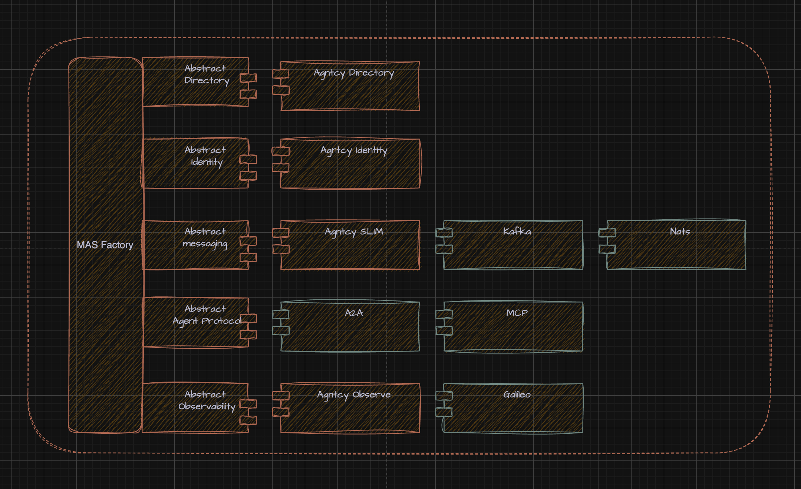

# TSC Introduction : coffeeAgntcy and app-sdk 


The AGNTCY is where we are building the Internet of Agents to be: ***A diverse, collaborative space to innovate, develop, and maintain software components and services for agentic workflows and multi-agent software.***

## Core Components

The initial set of IoA components and architecture is outlined below. This is a starting point - as new members join and bring their contributions, the collective will continue to evolve and expand the IoA architecture, components, and interfaces.


# CoffeeAgntcy

CoffeeAgntcy is a reference implementation based on a fictitious coffee company to help developers understand how components in the AGNTCY Internet of Agents ecosystem can work together. It gives examples of the components of AGNTCY working together as a Multi-agent System (MAS).

This project is meant to exemplify how AGNTCY and open-source agentic standards interoperate through clean, reproducible example code. It is purposefully designed for developers across experience levels, from those taking their first steps in building agentic systems to those with more experience curious about AGNTCY's offerings.

With CoffeeAGNTCY, you can:

- Learn how to leverage the AGNTCY App SDK Factory to write transport and agentic protocol-agnostic clients and server code.

- Explore SLIM and its support for unicast and group communication.

- Enable observability with the AGNTCY Observe SDK.

- Explore how to establish verifiable trust between agents using AGNTCY's Agent Identity Service.

- Learn how to write simple A2A client and server agents.

- Orchestrate agents using LangGraph for structured and stateful workflows

- Understand how to integrate data sources via MCP.

- Power pub/sub communication between agents via NATS broadcast and subscribe.

- How protocol-agnostic bridges and clients interconnect modular agents

CoffeeAGNTCY exposes two demo apps: Corto and Lungo.

## Corto

Corto is an intentionally simple demo app, serving as an accessible entry point for developers new to the agentic world or to AGNTCY. The Corto demo demonstrates the integration of an A2A client within a LangGraph workflow with an A2A server agent. It models a simplified agent system that acts as a coffee sommelier.

To learn more about Corto, head to the [README](https://github.com/agntcy/coffeeAgntcy/blob/main/coffeeAGNTCY/coffee_agents/corto/README.md)

## Lungo

Lungo is our ever-evolving demo application. As AGNTCY expands, Lungo grows alongside it. It adds new features and capabilities, demonstrating how they work together in an interoperable ecosystem.

Spinning up Lungo is as easy as:

```bash
cd $HOME/work/coffeeAgntcy/coffeeAGNTCY/coffee_agents/lungo
```

```bash
docker compose up
```

<a href="https://localhost:3000" target="_blank" style="font-size:1.25em; background:#007cba; color:#fff; padding:10px 20px; border-radius:6px; text-decoration:none;">
  🚀 Open Lungo UI
</a>


<div style="text-align:center; margin-top:1em; margin-bottom:1em;">
  
</div>

<div style="text-align:center; margin-top:1em; margin-bottom:1em;">
  
</div>

# App-SDK

* Build shared abstractions that let diverse agentic components interoperate cleanly.
* Emphasize interoperability as architecture
* Bridge protocols, messaging, and directories through lightweight, interoperable design.

---

### ⛭ **Working towards a universal MAS factory**



How do we use this in coffeeAgntcy ☕

**farm agent (server)**
```python
transport = factory.create_transport(
    transport_type, endpoint=endpoint, name=name
)
topic = A2AProtocol.create_agent_topic(server.agent_card)
bridge = factory.create_bridge(server, transport=transport, topic=topic)
await bridge.start(blocking=block)
```

**farm supervisor (client)**
```python
farm_topic = A2AProtocol.create_agent_topic(farm_A2A_card)
client = await factory.create_client(
  "A2A",
  agent_topic=farm_topic,
  transport=transport,
)

message: dict[str, Any] = {
    "message": {
        "role": "user",
        "parts": [{"type": "text", "text": "How much coffee do you currently have?"}],
    },
}
request = SendMessageRequest(
    id=str(uuid.uuid4()), params=MessageSendParams(**message)
)

# Send and validate response
response = await client.send_message(request)
```

### Come join us!

[coffeeAgntcy repo](https://github.com/agntcy/coffeeAgntcy) 🚀  
[app-sdk repo](https://github.com/agntcy/app-sdk/tree/main) 🚀
